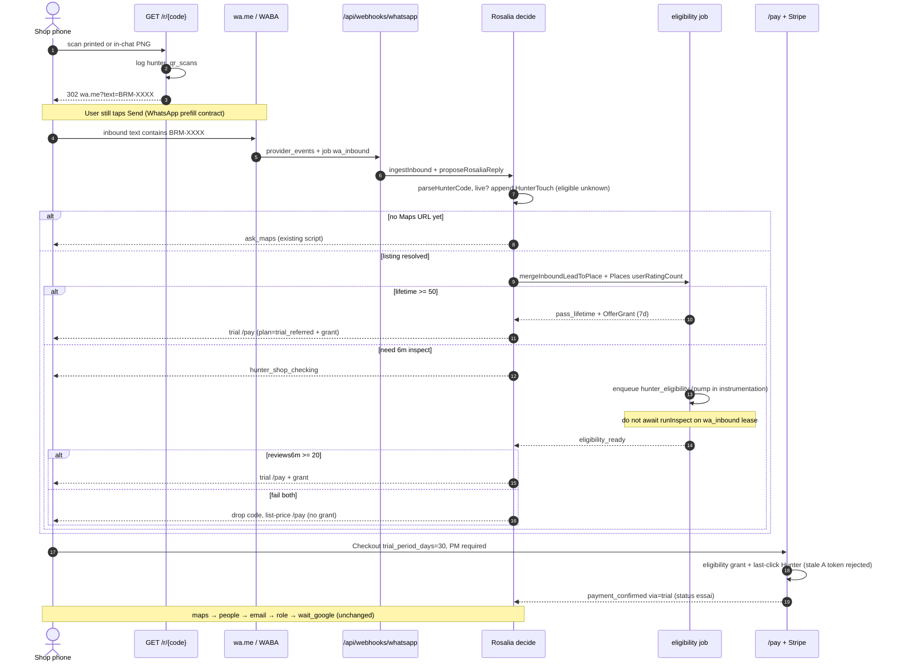
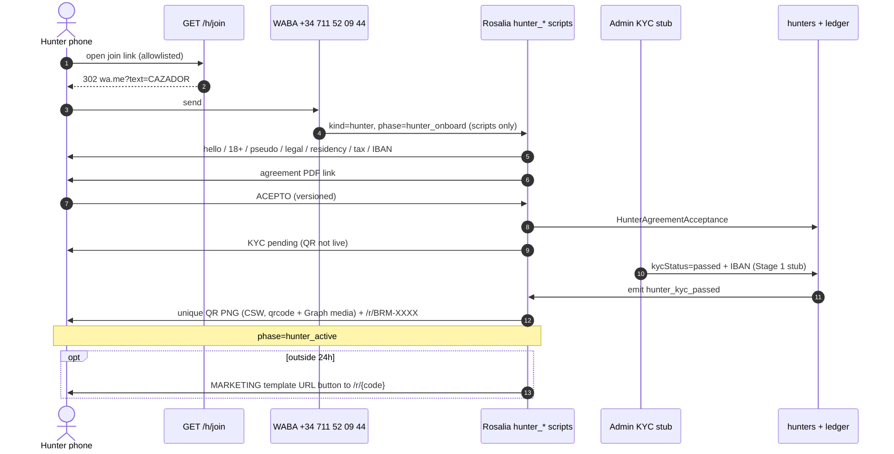
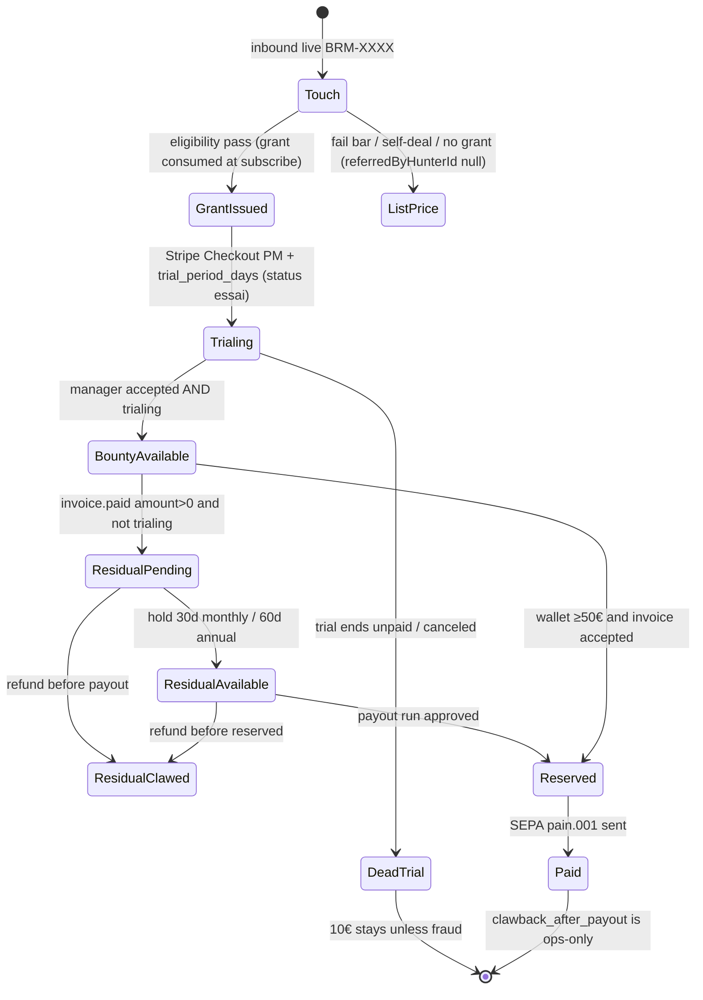
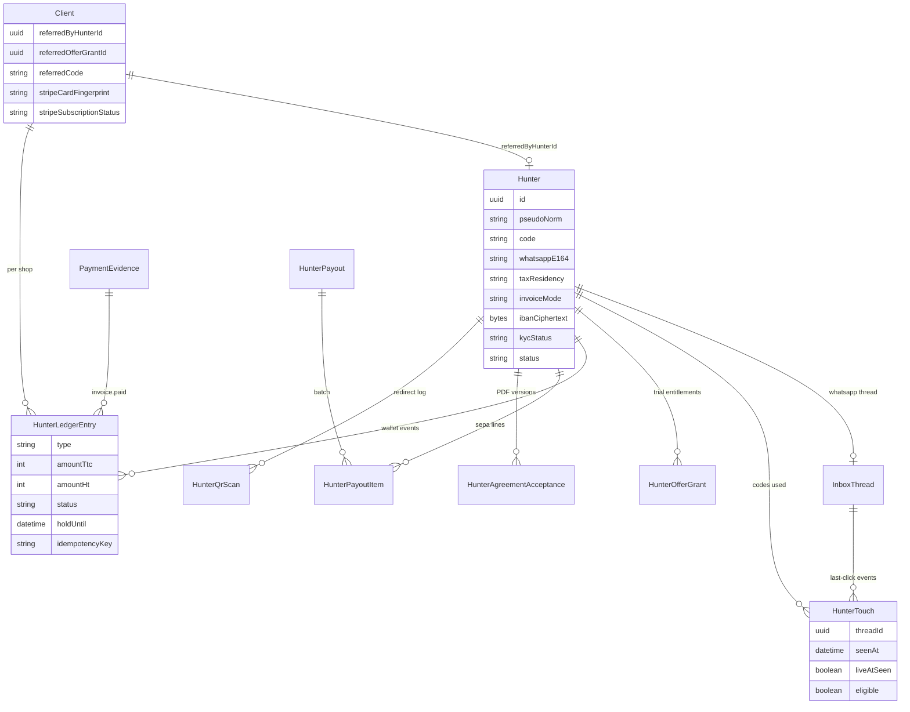

# Hunter channel (affiliate / introducer)

| Field | Value |
|---|---|
| **Status** | Draft |
| **Author** | engineering (from founder-locked product tree, 2026-09-08) |
| **Date** | 2026-09-08 (revised after design review) |
| **Repo** | factory `BenPomme/brmsocialbackend` (this workspace). Public site is `website` → `BenPomme/brmsocial`. |
| **Product lock** | Affiliate / hunter channel. User-facing name: **BabyHunters Program**. Not a shop-refers-shop credit loop. Not public. Not on `www.babyrock.ai`. |

---

## Overview

Babyrock pays **Hunters** (18+, EU/EEA) to bring independent shops onto **BabyRock Social**. A Hunter gets a unique code and QR. The shop scans, WhatsApp-opens Fil Babyrock with the code pre-filled, and Rosalia onboards the shop on the existing WABA (`+34 711 52 09 44`, webhook `/api/webhooks/whatsapp`). If the listing clears the **review bar** (≥5 new Google reviews in the last 30 days **and** a listing older than 3 months, Ben 18 Sep 2026), the shop gets **one** national 30-day Stripe trial with a payment method on file, a **new** catalogue offer, not Sant Cugat.

**Pay model (Ben, 18 Sep 2026).** The `socle` is **10 €** when the shop adds BRM as manager of its Google listing, whatever it picks afterwards, on Lite and on the no-card route included, and only once we hold a contact of its own (`hasDirectContact`: its WhatsApp, or the email it gave us). The `carte` bounty is **10 €**, only on **Plus or Pro**, when the card is registered; on **Lite** there is no card bounty, because 10 € would eat about a month of a 9,99 € subscription. Then **25 % of what the shop actually pays** (TTC) for its **first 6 months** on every plan; a prepaid year is capped at six months of commission. Scans are never paid. A shop below the bar gets no socle but still pays the `carte` if it subscribes to Plus or Pro. A shop that refuses the card but gives manager access takes the **free trial**: 3 answered reviews on the backlog it already has, 4 and 5 star only, no clock. Payout is monthly SEPA from the SL, floor **20 €** during the launch phase (`HUNTER_PAYOUT_FLOOR_TTC=2000`), after a real invoice (autofactura in ES; own invoice elsewhere in EU/EEA).

This is a factory feature: Prisma + Rosalia + `/pay` + Stripe webhooks + admin. It is **not** a marketing landing, **not** a public leaderboard, and **not** Fil commerce / Direct. Internally we do not call it “referral” as if shops refer shops. User-facing ES copy may say “trae un comercio” / código.

---

## Background & Motivation

Today acquisition is scout → email (and later one WhatsApp) with API CAC ~**1,8 € / client** (`16-plan-affaires.md`). The founder accepted this channel as a **sales channel**, not a cheaper email replacement: expected CAC **~154–236 € HT** if collected residual + free month + 10 €. That sits in the 20–30 % SaaS affiliate band (HubSpot 30 % collected / 12 months; Rewardful ~24 %).

Current catalogue only has one trial path: Sant Cugat (`SANT_CUGAT_OFFER` id `santcugat_trial`, pay plan `trial_santcugat` in `src/lib/skus.ts`, `src/lib/offers.ts`, `quoteFor()` in `src/lib/catalog.ts`, `/pay` query in `src/app/pay/page.tsx`). Reusing that offer for referred shops would silently give Sant Cugat’s **3-month catchup** and would not be a distinct offer id. Product lock: referred trial is a **new offer id**; catchup stays Sant Cugat 3 months / elsewhere 20 avis.

Pain points this design must not create:

- A second euro amount in WhatsApp copy (Catalogue rule: `quoteFor` is the only speech).
- Unique indexes on shop email / WhatsApp / card (`CONTEXT.md`: Paid Account fields are not unique keys). `Client.placeId` **is** unique.
- Mixing Hunter threads with Fil commerce (Direct). Same WABA, different `InboxThread.kind` / phase.
- Treating `isPitchable` (`REVIEW_FLOOR = 50` **and** reply rate &lt; 15 %) as the Hunter review bar. Inbound already bypasses pitchable (`pipelineStatus` uses `source === "inbound"`). The Hunter bar is **different**: ≥50 lifetime **OR** ≥20 in 6 months. No reply-rate test.
- Public named + city + revenue leaderboard (not allowed). Pseudos, affiliate-only, Rosalia on request.
- Paying a Hunter without factura (illegal for the SL). Option “wallet forever, never invoice” is out.

---

## Goals & Non-Goals

### Goals

1. Feature-flagged Hunter identity, unique **pseudo**, unique **code** `BRM-XXXX`, KYC + IBAN **before the QR is live**, versioned introducer agreement acceptance stored (timestamp, version, WhatsApp).
2. QR encodes `https://app.babyrock.ai/r/{code}` → **HTTP 302** to current `wa.me` with prefill `BRM-XXXX`. Scan logged. Destination can change without reprint.
3. Rosalia **scripts-first** (es/ca/en/fr) for Hunter onboarding and for shop inbound with a code. Happy path: no LLM (`07-modeles-couts.md`, `10-whatsapp-service.md`).
4. Eligibility job: Places `userRatingCount` (instant) vs DataForSEO `inspectReviews` (`src/lib/agents/inspect.ts`). Fail → drop the code, list-price `/pay`, no 10 €, no residual.
5. **Classic SaaS last-click cookie:** last **live** code whose inbound is within 30 days of `fulfillCheckoutSession`. After the window, a new coded inbound starts a new 30-day window. Scout email may still happen; last-click at subscribe wins. No territory. **Grant = shop eligibility** (thread + `placeId` + bar). **Touch ≠ entitlement:** fail the review bar or self-deal or dead last-click → list-price `/pay`, `referredByHunterId` stays null, no 10 €, no residual. A stale grant token whose issuer ≠ last-click is rejected (never pay Hunter A).
6. New pay plan `trial_referred` + offer id `referred_trial`. Stripe Checkout `trial_period_days: 30` + payment method required. Does not stack with Sant Cugat (still **one** free month). `fulfillCheckoutSession` must treat `trial=referred` as trial in the **same** PR that first writes that metadata (today only `santcugat` yields `essai`).
7. Append-only commission ledger: `socle`, `carte`, `residual`, `clawback`, `payout`. Each of the two 10 € bounties is written once per shop (`socle:<clientId>`, `carte:<clientId>`), whatever the order the two events arrive in. No clawback of a bounty unless fraud. Residual unpaid **is** clawed on refund.
8. Monthly SEPA batch, ≥20 € floor, leftover on next run or on exit. **Do not** forfeit at 6 months. ES autofactura + WhatsApp accept; other EU/EEA upload invoice + reverse charge. Admin approve. No Stripe Connect in v1.
9. Self-deal block (v1): same WhatsApp (`phoneTail`), NIF/CIF, `/pay` email vs `Hunter.email`, Stripe card fingerprint, or `place_id` already a Paid Account matching those contacts. **Not** GBP “owner email” (`Client.googleAccountEmailManager` is `reviews@babyrock.ai`). Ops flags for dead trials; no volume cap on 10 €.
10. Two **full** boards (not top 10), **not public**, not on `www.babyrock.ai`. Rosalia `ranking` + admin table.
11. Admin: Hunters, wallets, flags, boards, payout runs.

### Non-goals (v1)

- UK / US / LatAm payees.
- Stripe Connect, in-chat WhatsApp Payments (Spain has none), Bizum to Hunters.
- Public marketing leaderboard or Hunter landing in this factory **or** in `website`.
- Shop-refers-shop credits. Direct (`direct`) commission. Pack.
- WhatsApp Flows / In-App Signup (blocked in EEA). Meta `message_qrdls` as the primary QR (no analytics, 2000/number cap) — optional fallback only.
- Territory, quotas, scripts-as-orders, shifts, employment, parental consent as a substitute for 18.
- Autofactura of a French micro-entreprise.
- Reopening catalogue prices, residual %, trial length, payout floor, or the review bar.

---

## Key Decisions

1. **New Prisma `Hunter` aggregate, not a `Client`.** A Paid Account is one shop / one subscription. A Hunter is a person we pay. Reusing `Client` would collide with `place_id` uniqueness, billing status, and operator queues (`isEntitledToSocial` / `BILLING_ACTIVE`).
2. **Same WABA, new thread kind `hunter`.** `InboxThread` stays unique on `[channel, counterparty]`. Hunter and shop are different phones. `ThreadPhase` gains `hunter_onboard` | `hunter_active`. Shop threads keep today’s `outreach` → `awaiting_pay` → `onboarding` → `active` | `stopped`. Direct / Fil commerce is untouched.
3. **New catalogue offer `referred_trial`, new pay plan `trial_referred`.** Do not reuse `santcugat_trial` / `trial_santcugat`. SKU amounts still come from `SKUS.avis_month` (99 € TTC). Catchup: Sant Cugat city still 3 months; everyone else 20 avis. One free month if both apply.
4. **QR is `app.babyrock.ai/r/{code}` 302, not Meta `message_qrdls` and not a printed `wa.me`.** Prefill contract is the literal token `BRM-XXXX` so Rosalia can parse it even if the shop edits the rest. 302/307, never 301.
5. **Review bar is not `isPitchable`.** New `isReferredTrialEligible()` in `src/lib/hunter/eligibility.ts` (do not change `src/lib/pipeline.ts` `isPitchable`). Lifetime ≥50 **OR** 6m ≥20. No reply-rate conjunct. Fail closed on inspect timeout after retries. **v1 listing resolve is a Google Maps URL** via existing `ask_maps` + `resolveMapsListing({ mapsUri })` (`src/lib/shop-maps.ts` requires `mapsUri`; it does **not** take name+city).
6. **Grant = shop eligibility; last-click = who gets paid.** `HunterOfferGrant` proves thread + `placeId` + review bar (not attribution). `referredByHunterId` is the last **live** code inbound with `seenAt >= fulfillCheckoutSession − 30 days` (classic SaaS cookie; hunter still QR-live). After the window, a new coded inbound starts a new 30-day window. **Touch ≠ entitlement:** no unexpired grant matching `wa` + `placeId` → no referred trial. Last-click empty/dead → list price (or Sant Cugat on its own), `referredByHunterId` null, no bounty. A presented token whose `hunterId` ≠ last-click is **rejected** (never silently pay A). Failed-bar touches stay analytics (`eligible=false`).
7. **10 € is an advance against that shop’s first residual, not additive CAC on a converted shop.** Grant on Stripe `trialing` ∧ manager accepted ∧ consumed grant ∧ not self-deal. Residual **must not** key off `Client.status === "essai"`: `markManagerConnected` already flips `essai`/`paye` → `actif` (`src/lib/rosalia-reply.ts`). Use `isReferredTrialing()` = Stripe subscription `status === "trialing"`. If the shop never pays, the 10 € stays (no clawback unless fraud). Identity of residual: `25% × TTC` at 21 % IVA = `25% × HT × 1.21`. Never treat 24,75 € as HT.
8. **Ledger is append-only events; wallet is a projection.** Payout is a SEPA batch from the SL Revolut IBAN already used for Stripe. Invoice (autofactura or upload) **before** SEPA. Floor 50 €; leftover on next run or exit; no 6-month forfeiture.
9. **Leaderboard: WhatsApp snippet (top + you + neighbours) + short signed URL on the factory for the full list.** Token is a **hunter-board JWT**, not `signSession` / `verifyToken` (`src/lib/auth.ts` rejects any `role` outside `admin|operator|client`). TTL 24 h. Not `www.babyrock.ai`. Pseudos only. Legal name admin-only.
10. **Whole channel behind `HUNTER_CHANNEL=true` plus an allowlist.** Empty `HUNTER_ALLOWLIST` = nobody (opposite of `WHATSAPP_ALLOWLIST`, where empty = everyone — `src/lib/whatsapp-send.ts`). Stage 1 numbers must be on **both**. Internal numbers first. Link-in-bio `/pay` without a live grant stays list price.
11. **Self-deal checks compare facts; they do not unique-index shop email/WhatsApp/card.** `place_id` remains the only unique shop key. Card fingerprint is stored on `Client` at subscribe (Checkout expand + `payment_method.attached`), nullable, non-unique. v1 signals: WhatsApp, NIF, `/pay` email, fingerprint, `place_id`.
12. **Introducer, not agent.** Product + agreement + implementation: no authority to bind, no duty to keep walking, no territory, no quotas, Rosalia closes. Counsel drafts the live PDF; we store acceptance. Reality over *nomen iuris* (LCA art. 3.1) is a legal residual risk, not a code path.

---

## Glossary additions (propose for `CONTEXT.md`)

Do **not** ship a second glossary. Add these terms to `CONTEXT.md` in the catalogue PR (or a tiny docs PR with schema). Exact wording:

**Hunter**  
A person 18+ in the EU/EEA whom we may pay to introduce shops to BabyRock Social. Introducer: they do not quote, close, or bind. Not an employee. Not a Paid Account. Admin English may say affiliate; internally not “referral” as if shops refer shops.  
_Avoid_: ambassador, partner, employee, agent (as a labour/LCA label), treating a Hunter as a `Client`

**Hunter code**  
Unique token `BRM-XXXX` for one Hunter. Prefills WhatsApp. Last **live** code whose inbound is within 30 days of Stripe subscribe (classic SaaS last-click cookie) is who we may pay. After the window, a new coded inbound starts a new 30-day window. Referred trial also requires an unexpired **eligibility grant** (thread + `placeId` + review bar). A stale grant whose hunter ≠ last-click is rejected. A code on a failed-bar thread is analytics only.  
_Avoid_: coupon, promo, territory, unique-indexing a shop WhatsApp to a Hunter, treating a WhatsApp touch as commission entitlement, treating the grant token as the Hunter identity

**Wallet**  
The Hunter’s running balance from an append-only commission ledger. Paid by monthly SEPA from the SL at ≥50 € after invoice (autofactura ES / own invoice other EU). Leftover stays until the next run or exit. Not forfeited at 6 months.  
_Avoid_: Stripe Connect, shop credit, gift card, “referral balance”

**Referred trial**  
Catalogue offer `referred_trial` / pay plan `trial_referred`: one national 30-day Stripe trial with payment method, for a shop that arrived with a **live** Hunter code and passed the review bar (≥50 lifetime Google reviews or ≥20 in 6 months). Does not stack with Sant Cugat (still one free month). Catchup unchanged.  
_Avoid_: reusing `santcugat_trial` / `trial_santcugat`, a second euro amount in copy

---

## Proposed Design

### 1. Identity & codes

**Record.** New table `hunters` (Prisma `Hunter`). One row per person we might pay. Linked to at most one WhatsApp Fil Babyrock thread (`InboxThread.kind = "hunter"`). Legal name is **admin-only**; Rosalia and boards use `pseudo`.

| Field | Rules |
|---|---|
| `pseudo` | Mandatory unique gamer tag. Unicode letters/numbers, 3–24 chars, stored canonical case-insensitive (`pseudoNorm` unique). No leading/trailing space. Reserved: `rosalia`, `babyrock`, `admin`, `fil`. |
| `code` | Unique `BRM-XXXX`. Crockford base32 alphabet `0123456789ABCDEFGHJKMNPQRSTVWXYZ` (no I, L, O, U). 32⁴ = 1 048 576 codes. Issued at Hunter create, **not** shown as QR until KYC + IBAN + agreement. |
| `whatsappE164` | Digits. Unique **on Hunter** (one hunter thread per number). Compared to shops via `phoneTail()` in `src/lib/bind-shop.ts` — **do not** unique-index `Client.whatsappOwner`. |
| `email` | For KYC / invoices. `@unique` **among Hunters** (Postgres unique allows several `NULL`s). Not a unique key vs Paid Accounts. |
| `legalName` | Admin + autofactura. Never on boards. |
| `dateOfBirth` | 18+ gate. Parental consent does not replace majority (LGSS art. 7 RETA). |
| `taxResidency` | ISO 3166-1 alpha-2 from `EEA_ISO` (EU27 + `NO`, `IS`, `LI`). Not a boolean `ES\|EU` — Norway is EEA and not VIES. `GB`/`US`/`LATAM` rejected in v1. |
| `taxId` | ES NIF/NIE/CIF, or VIES VAT / national tax id. Normalized like `normalizeTaxId()` in `src/lib/pay.ts`. |
| `invoiceMode` | `autofactura_es` if `taxResidency === "ES"`; `own_invoice_eu` otherwise (incl. NO/IS/LI). We do **not** autofactura a French micro-entreprise. |
| `ibanCiphertext` | AES-256-GCM with `HUNTER_PII_KEY`. Admin UI shows last4 + bank country. Required before QR live. |
| `kycStatus` | `none` \| `pending` \| `passed` \| `failed` \| `expired`. QR live iff `passed`. **Admin may set `passed`** for allowlisted Stage 1 numbers (`requireRole(["admin"])`); vendor webhook is later. |
| `kycVendorRef` | Opaque id from the vendor (vendor itself is an open question). |
| `status` | `onboarding` \| `live` \| `paused` \| `exited` \| `banned`. |
| `irpfRateBps` | Default **0** if ES `taxId` looks like a **sociedad** (CIF letter A–H, J, N, P–S, U–W); **1500** (15 %) if NIF/NIE autónomo. Counsel still confirms 7 % vs 15 % for new professionals. |
| Agreement | Source of truth = `HunterAgreementAcceptance` (version, timestamp, WhatsApp message id). Hunter may denorm `agreementCurrentVersion` for the QR-live query only. |

```ts
export const EEA_ISO = [
  "AT","BE","BG","HR","CY","CZ","DK","EE","FI","FR","DE","GR","HU","IE","IT",
  "LV","LT","LU","MT","NL","PL","PT","RO","SK","SI","ES","SE",
  "NO","IS","LI",
] as const;
```

**Code format and parser** (shared module `src/lib/hunter/code.ts`):

```ts
export const HUNTER_CODE_RE = /\bBRM[-–—\s]?([0-9A-Z]{4})\b/i;

const CROCKFORD: Record<string, string> = { I: "1", L: "1", O: "0", U: "V" };

export function parseHunterCode(text: string): string | null {
  const m = text.normalize("NFKC").toUpperCase().match(HUNTER_CODE_RE);
  if (!m) return null;
  const body = m[1].replace(/[ILOU]/g, (ch) => CROCKFORD[ch]);
  if (!/^[0-9A-HJKMNP-TV-Z]{4}$/.test(body)) return null;
  return `BRM-${body}`;
}
```

Issued codes stay Crockford (no I, L, O, U). The capture is `[0-9A-Z]{4}` so OCR typos (`BRM-O0I1`) still parse; then map I/L→1, O→0, U→V and look up the canonical code. A mapped token that does not exist is a dead code (no window, no entitlement).

Prefill contract: `wa.me` `text=` is **exactly** `BRM-XXXX` (no greeting). Rosalia still parses if they write `Hola BRM-AB12 quiero info`.

**QR live gate.** `hunterQrLive(h)` = feature flag on ∧ `HUNTER_ALLOWLIST` hit ∧ `status === "live"` ∧ `kycStatus === "passed"` ∧ IBAN present ∧ a `HunterAgreementAcceptance` for the current version ∧ 18+. `/r/{code}` for a non-live Hunter 302s to `wa.me` **without** the code (ordinary hello) and logs `qr_not_live`. Codes of `exited`/`banned` are not recycled for 12 months.

Stage 1 has **no KYC vendor**. Admin PATCH `/api/admin/hunters/:id` may set `kycStatus=passed` and paste IBAN for allowlisted numbers (`requireRole(["admin"])`, same guard as `src/app/api/admin/billing/route.ts`). That is how founder phones get a live `BRM-XXXX` before PR 6.

### 2. QR & redirect

```
GET https://app.babyrock.ai/r/BRM-XXXX
  → insert hunter_qr_scans (code, hunterId, ip, ua, at, dest)
  → 302 Location: https://wa.me/34711520944?text=BRM-XXXX
```

- Route: `src/app/r/[code]/route.ts`. **302 or 307, never 301** (destination must remain changeable without reprint).
- E.164 from `BABYROCK_WHATSAPP_E164` (prod `+34 711 52 09 44`, same as `10-whatsapp-service.md`). `wa.me` uses digits, no `+`.
- Unknown code: 302 to `wa.me` without text (do not 404; do not leak whether a code exists beyond timing). Log `qr_unknown`.
- Middleware (`src/middleware.ts`) does **not** auth this path (matcher is `/admin|/operator|/client` only — public-by-omission, verified). Response headers: `X-Robots-Tag: noindex`.
- **Rate-limit** in this route (PR 3): 30 scans / IP / minute; excess still 302s to generic `wa.me` (no prefill) and logs `qr_ratelimit`. Count from `hunter_qr_scans` (or an in-process counter with DB fallback).
- **Print vs in-chat:** same PNG (token + Babyrock mark, quiet zone, PNG ≤ 5 MB). New deps in PR 3: `qrcode` (PNG) — `package.json` has neither QR nor HTTP media helpers today. Upload: Graph `POST /{PHONE_NUMBER_ID}/media` then `sendWhatsappImage` (`type: image`, `image.id`) next to `sendWhatsappText` in `src/lib/whatsapp-send.ts`. Image **only inside the 24 h CSW**. After 24 h: MARKETING template with URL button to `/r/{code}` — not a re-upload. Hunter is told to screenshot / save the image for print. v1 does not ship a print PDF sheet.
- Meta `message_qrdls` is **not** v1 (140 char prefill, max 2000/number, no scan log).

### 3. Rosalia — Hunter onboarding

**Entry** (flag on, allowlist hit):

- Prefill join: `/h/join` 302 → `wa.me` text `CAZADOR` (or ES `QUIERO TRAER COMERCIOS`).
- Keywords in an **unbound** shop-outreach thread: `cazador`, `afiliado`, `traer comercios`, `hunter`, `QUIERO TRAER COMERCIOS`. If the number is already `phase in (onboarding, active)` as a shop, **do not** convert — self-deal / dual-use: keep shop, tell them a Hunter needs another WhatsApp.
- Internal rollout: `HUNTER_ALLOWLIST` digits; non-allowlisted keyword → current shop FAQ (no Hunter copy).

**Thread:** set `InboxThread.kind = "hunter"`, `phase = "hunter_onboard"`.

**Scripts-first short-circuit (required — today’s call graph will otherwise pitch 99 €):**

`proposeRosaliaReply` (`src/lib/rosalia-reply.ts`) today (1) builds `payUrl({ wa, city, maps })` at ~line 169, which auto-sets `plan=trial_santcugat` only for SC city, (2) unless `ROSALIA_LLM=false` or inbound is `stop`, calls the LLM with `talkPrompt` + `quoteFor({ city, inbound })` with **no** `referredTrial`, (3) `asPhase` maps anything other than `awaiting_pay|onboarding|active|stopped` to **`outreach`**. `decideRosalia` always `quoteFor({ city, inbound: text })` and unknown phases fall through to `outreachFaq` (`ok`/`pay` + `{{PAYURL}}`). `DecideInput` has no `kind`, Hunter step, or eligibility.

PR 3 must change that:

1. **Exhaustive `asPhase`.** Return type stays `ThreadPhase | null` — **not** a new phase. Known: current five shop phases **plus** `hunter_onboard` | `hunter_active`. Unknown (including a missed hunter phase) → `null`. Caller: `decisionFromScript("fallback")` **without** writing phase; **do not** call `outreachFaq`; **do not** run the LLM. `needs_human` is `InboxThread.status` / `RosaliaDecision.status`, not a `ThreadPhase`. Adding it to the union would break `decideRosalia`’s phase switch. **Never** coerce unknown to `outreach` (today `asPhase` in `src/lib/rosalia-reply.ts` does exactly that):

```ts
function asPhase(v: string | null | undefined): ThreadPhase | null {
  if (
    v === "outreach" || v === "awaiting_pay" || v === "onboarding" ||
    v === "active" || v === "stopped" ||
    v === "hunter_onboard" || v === "hunter_active"
  ) return v;
  return null;
}
```
2. If `thread.kind === "hunter"` **or** inbound parses a **live** `BRM-XXXX`, **force scripts for that turn** (do not call `xaiComplete` / `talkPrompt` / `get_catalog_quote` / `create_checkout`). `ROSALIA_LLM` may stay true for ordinary shop FAQ.
3. Extend `DecideInput` / `RosaliaDecision`:

```ts
export type HunterOnboardingStep =
  | "hello" | "age" | "pseudo" | "legal" | "residency"
  | "tax" | "iban" | "kyc" | "agreement" | "done";

export type DecideInput = {
  // existing fields…
  threadKind: "outreach" | "hunter";
  hunterStep: HunterOnboardingStep | null;
  referredTrial: boolean;          // true only after eligibility pass
  eligibility: ReferredEligibility | null;
  offerGrantToken: string | null;
};
```

4. Compute `quoteFor` / `payUrl` **after** eligibility (and after Hunter vs shop branch), not at line 169. Trial `/pay` is minted only when `referredTrial === true` and a grant token exists. Failed bar → list-price `/pay` with **no** grant query param.
5. `catalogQuoteResult` / `get_catalog_quote` must not run on hunter or coded-shop turns. When it does run for a referred-eligible shop (should be rare: LLM off), branch `speak` on `offer.id` (Issue 5) — never “Sant Cugat” for `referred_trial`.

**Steps** (`HunterOnboardingStep`, scripts in `src/lib/rosalia/copy.ts`, four languages):

| Step | Script id | Gate |
|---|---|---|
| 1 | `hunter_hello` | What it is: introduce shops, we close, no quoting, no cold WA/email/DM to shops (LSSI art. 21 + Meta opt-in). |
| 2 | `hunter_age` | “¿Tiene 18 años o más?” Bare `OK`/`SÍ` is not enough — ask DD/MM/YYYY or an explicit “tengo X años”. &lt;18 → stop, no QR. |
| 3 | `hunter_pseudo` | Unique. Collision → ask another. |
| 4 | `hunter_legal` | Legal name + email. “Solo lo ve administración.” |
| 5 | `hunter_residency` | Country from EEA ISO list (EU27 + NO/IS/LI). UK/US/LatAm → `hunter_geo_out`. |
| 6 | `hunter_tax` | NIF/NIE or VAT. ES → we will autofactura (RD 1619/2012 art. 5); they still need alta censal; RETA if habitual. Other EEA → they will invoice us; reverse charge. |
| 7 | `hunter_iban` | IBAN; checksum (mod-97) in-script; no payout until KYC + invoice. |
| 8 | `hunter_kyc` | Stage 1: “un compañero confirma tu identidad” (admin stub). Later: vendor link. QR **not** live until `kycStatus=passed`. |
| 9 | `hunter_agreement` | Link to `/legal/affiliate?v={version}`. Accept = inbound `ACEPTO` matching current version. Insert `HunterAgreementAcceptance`. |
| 10 | `hunter_qr` | On `kycStatus=passed` (admin stub or vendor webhook): send PNG + `https://app.babyrock.ai/r/{code}`. Phase → `hunter_active`. |

Happy path is scripts only. Off-script → `fallback` / human (`status: needs_human`), same as shop. `STOP`/`BAJA` on a Hunter thread stops **Hunter pings** (MARKETING templates) and sets `status=paused`; it is not a shop `baja_active` and does not cancel a Paid Account.

**Post-live scripts (MARKETING templates when outside CSW; CSW free-form inside 24 h):**

- `hunter_earned` — “Has ganado X € (pendiente de factura / SEPA)”. Incentivized → **MARKETING**, opt-in recorded at agreement.
- `hunter_ranking` — FAQ `ranking`.
- `hunter_keep` — nudge to keep introducing. No quotas, no “you must walk N shops”.
- `hunter_invoice_es` — autofactura PDF + `ACEPTO FACTURA {series}-{n}`.
- `hunter_payout` — SEPA sent.

Do not use Utility for these; Meta will recategorize incentivized copy.

Hunter FAQ `ranking` / `wallet` / `code` / `iban` / `factura` are first-class script ids so the LLM router (`decisionFromScript`) cannot invent amounts. Euros in Hunter copy come from the ledger projection + `formatTtcSpeech`, not hardcoded strings.

### 4. Rosalia — shop inbound with a code

Shop scan sequence is a **shop** thread (`kind` stays default `outreach`). The inbound body contains `BRM-XXXX`.

Existing onboarding after pay is unchanged: maps → people → email → role → wait_google (`OnboardingStep` in `src/lib/rosalia/types.ts`, `continueOnboarding` in `decide.ts`). The new work is **before** `/pay`: parse code, write a touch event, **ask for a Maps URL**, eligibility, then send the right `/pay` URL.

v1 does **not** resolve “name + city”. `resolveMapsListing` (`src/lib/shop-maps.ts`) **requires `mapsUri`** and only uses `name` as a Places text-search fallback when the URL has no place id. Sequence: existing `ask_maps` until a Maps URL is present, then `resolveMapsListing({ mapsUri })`. A later name+city helper would be `searchText({ textQuery: \`${name} ${city}\` })` with 1-hit auto-bind / N-hit `which_shop` — out of v1.

`payUrl()` in `src/lib/rosalia-reply.ts` today sets `wa`, `city`, `maps`, and `plan=trial_santcugat` when `isSantCugat(city)`. Call it **after** eligibility:

```ts
payUrl({
  wa, city, maps,
  plan: "trial_referred" | "trial_santcugat" | "month" | "year",
  code,           // BRM-XXXX — informational; server does not honour this alone
  offerGrant,     // capability token proving eligibility; omitted on fail
});
```

Rosalia **must not** say “primer mes 0 €” unless `quoteFor({ city, referredTrial: true })` returns that offer. Update script `trial` in `copy.ts` (today: “No hay mes gratis salvo Sant Cugat”) so that:

- no code → existing Sant Cugat-only sentence;
- live code + pending inspect → “estamos comprobando la ficha”;
- live code + pass → referred `offerLines` from `quoteFor` (never “Sant Cugat” as the reason, even if the city is SC);
- live code + fail → list price, **drop the code for economics**, no free month, no 10 €, no residual (one sentence, then normal `ok`/`pay` script). Empty `cityHintLines` when `referredTrial` so we do not advertise SC on a referred fail either.

Affiliate agreement **bans** the Hunter from cold WhatsApp/email/DM to shops. If we detect a Hunter code on a thread we ourselves outreached (`Lead.outreachStatus` in `sent|approved` and first inbound is not a code), last-code-at-subscribe still wins **if a grant is consumed** (product lock) but we log `touch_on_scouted_lead` for ops — we do not punish the shop.

### 5. Eligibility job

**Bar** (new helper, do **not** call `isPitchable`):

```ts
export const HUNTER_LIFETIME_FLOOR = 50;      // Places userRatingCount
export const HUNTER_REVIEWS_6M_FLOOR = 20;    // inspectReviews

export type ReferredEligibility =
  | { kind: "pass"; via: "lifetime" | "reviews_6m"; lifetime: number; reviews6m: number | null }
  | { kind: "fail"; lifetime: number; reviews6m: number | null }
  | { kind: "need_inspect"; lifetime: number }
  | { kind: "pending"; jobId: string };
```

**Algorithm** (`src/lib/hunter/eligibility.ts`):

1. Resolve listing from a **Maps URL only**: `resolveMapsListing({ mapsUri })` → `placeId`, `ratingCount` (`userRatingCount`). No name+city path in v1.
2. **`mergeInboundLeadToPlace(threadId, googlePlaceId)`** (explicit, PR 4). Inbound today creates `placeId: inbound:whatsapp:+34…` (`src/lib/inbox.ts`). `Lead.placeId` is `@unique`. A naive `update` to the Google id throws `P2002` if scout already has that listing.
   - If a scout/inbound row already has that `placeId`: set `InboxThread.leadId` to it; copy `waSite` from the stub if empty; **do not** overwrite `outreachStatus` / `outreachBody` (needed for `touch_on_scouted_lead`); delete the stub row only if its `placeId` still starts with `inbound:` and it is not the kept row.
   - Else: `update` the stub’s `placeId` + listing fields (name, city, mapsUri, `userRatingCount`).
   - Thread always points at exactly one Lead afterwards. Never fork two leads for one listing.
3. If `userRatingCount >= 50` → **pass_lifetime**. Instant. No DataForSEO. Issue an **eligibility** `HunterOfferGrant` (thread + `placeId` + bar snapshot; TTL **7 days**, not `capability.ts`’s 24 h). `hunterId` on the grant is the **issuer at mint time** (audit), not who we pay.
4. Else if `lead.inspectAt` is set **and** we are not in a truncation retry → use stored `inspectReviews`. ≥20 → **pass_6m**. Else **fail**.
5. Else enqueue **`job.kind = "hunter_eligibility"`** `{ leadId, threadId, hunterId, force?: boolean, minDepth?: number }`. Reply script `hunter_shop_checking`. **Do not** `await runInspect` inside `proposeRosaliaReply` (DataForSEO `timeoutMs: 150_000` would sit on the `wa_inbound` lease). Do not send a trial `/pay` yet. If they insist on paying immediately, send **list-price** `/pay` (no grant token); a later code cannot upgrade an already list-price Paid Account in v1. Prefer they wait.
6. **Worker.** `src/instrumentation.ts` today starts only fiche-watch, `wa_inbound`, and GBP invites. Admin inspect uses `enqueueAndRun` **inside the HTTP request** (`src/app/api/admin/inspect/route.ts`, `maxDuration = 180`). Nothing calls `claimJobs("inspect")`, so `JOB_MAX_ATTEMPTS` / `runAfter` never reclaim a failed inspect. `runJob` **throws** on unknown kinds (`src/lib/jobs.ts` `else`). PR 4 adds `startHunterJobLoop()` next to `startWaInboundLoop` (`src/lib/wa-inbound-loop.ts` pattern: `claimJobs` + 3 s tick) with a single array:

```ts
// src/lib/hunter/loop.ts — one array; PRs 5 and 6a append
export const HUNTER_JOB_KINDS = [
  "hunter_eligibility",    // PR 4
  // "hunter_release_holds", // PR 5 + jobs.ts dispatch
  // "hunter_payout_propose", // PR 6a + jobs.ts dispatch
] as const;
```

Fire-and-forget `enqueueAndRun` on a request is **not** a substitute. Each new kind must land in **both** the loop array and `runJob`’s switch in the same PR.
7. The `hunter_eligibility` worker calls a widened inspect:

```ts
runInspect({ leadIds, force: true, minDepth?, onComplete?: "eligibility" })
```

   Today `runInspect` **only selects `inspectAt: null`** and `persistInspect` is unexported. `force: true` ignores `inspectAt` (needed for truncation retry). `onComplete: "eligibility"` is the **only** path that emits `eligibility_ready` — first-scan/admin inspect must not spam shop threads. Payload flag `hunterEligibility` on kind `inspect` is **ignored** by current `runJob`; do not rely on it.
8. Pass → issue/re-issue an eligibility `HunterOfferGrant` for this **thread + placeId**, trial `/pay` with the new token. Fail → script `hunter_shop_fail`: drop the code for economics, 99 €/mes, no 10 €, no residual. Shop can still become a Paid Account at list price. Touches remain `eligible=false`.
8b. **New live code after a pass (last-click refresh):** append `HunterTouch` (`liveAtSeen=true`). **Expire** every unconsumed grant for this `threadId` + `placeId`. Mint a new grant (issuer = that Hunter, same place, 7 d). Send a new `/pay` URL. Hunter A’s old token must not remain redeemable. This is how last-click stays aligned with the URL in chat.
9. **Truncation:** if `inspectTruncated && reviews6m < 20`, enqueue **one** `hunter_eligibility` with `force: true` and higher `minDepth` (capped by `inspectMaxDepth()`). Still truncated and &lt;20 → **fail closed**.
10. **Timeouts:** if the job is `dead` (3 attempts) or 2 h elapsed with no pass/fail → fail the 6m branch. Lifetime ≥50 already passed in step 3.
11. **Cost / abuse:** cap **10** `hunter_eligibility` jobs per Hunter per UTC day. Excess → ops flag `inspect_flood`, list-price path, founder ping.

`eligibility_ready` is handled in `decideRosalia` like `payment_confirmed`: `sendPolicy: "if_window"`; outside 24 h use template `shop_eligibility` (not incentivized). **Re-issue** the grant on this event and on shop `pay` FAQ so a weekend inspect wait does not burn a 24 h token. Grant `expiresAt` = `now + 7 days` (or `seenAt + 30 days` of the winning touch, whichever is sooner).

### 6. Attribution (classic SaaS last-click cookie)

Not a browser cookie, and **not** a thread-unique closed window that kills a day-40 scan. Product lock: last **live** code whose inbound is within 30 days of `fulfillCheckoutSession`. After the window, a new coded inbound starts a new 30-day window.

Table `hunter_touches` is an **append-only event log** (`threadId` is **not** unique):

| Column | Meaning |
|---|---|
| `threadId` | Shop `InboxThread` |
| `hunterId` / `code` | Parsed code |
| `liveAtSeen` | Hunter was QR-live at inbound (dead codes never win) |
| `eligible` | `true` only if a grant was issued for this thread+place (analytics: fail-bar touches stay `false`) |
| `seenAt` | Inbound time |
| `attachedClientId` | Set at subscribe on the **winning** row only |

**Winner at subscribe:**

```sql
SELECT * FROM hunter_touches
WHERE thread_id = $thread
  AND live_at_seen = true
  AND seen_at >= $subscribeAt - interval '30 days'
ORDER BY seen_at DESC
LIMIT 1
```

A scan on day 0 + subscribe on day 40 with no new scan → **no** Hunter (window expired). A scan on day 0 + another Hunter on day 40 + subscribe on day 41 → **second** Hunter. A **dead** code does not win and does not start a window.

**Grant = eligibility, last-click = attribution.** The grant does **not** choose the Hunter. It proves this shop thread + listing passed the bar.

`createCheckoutSession` / `fulfillCheckoutSession` (`src/lib/pay.ts`):

1. **Eligibility (reject referred trial unless true):** unexpired grant, `consumedAt` null, token hashes to `HunterOfferGrant.tokenHash` (`@unique`); checkout `whatsapp` `phoneTail`-matches the grant thread (`src/lib/bind-shop.ts`); resolved `placeId` equals `grant.placeId`; snapshot still pass; not self-deal.
2. **Last-click Hunter:** run the SQL above. Hunter must still be QR-live (`hunterQrLive`). That row’s `hunterId` / `code` → `Client.referredByHunterId` / `referredCode`.
3. **If last-click is empty or dead:** do **not** attach a Hunter. Referred trial is refused → list price (or Sant Cugat on its own). `referredByHunterId` null, no bounty, no residual.
4. **If `grant.hunterId` is set and ≠ last-click `hunterId`:** **reject** this Checkout (400, “pida el enlace de nuevo”). Never attach A from a stale token while last-click is B. Do not silently rewrite the payer to B on A’s URL either — expire-on-new-code (step 8b) should already have killed A’s token; this is the belt.
5. Consume the grant onto the Client (`referredOfferGrantId`) in the same transaction as the attach.

Otherwise the shop may still subscribe at **list price** (or Sant Cugat). Touches remain analytics (`eligible=false` on fail/self-deal). `accrueResidual` and `grantCarte` require `referredOfferGrantId` **and** `referredByHunterId` (last-click), not a grant.hunterId. `grantSocle` asks the same, plus the shop's own contact, and the manager-only route writes both from `attributeHunterToClient` (last live touch within 30 days) when no checkout ever did.

Scout-attributed email does **not** write `referredByHunterId`. Last live code at subscribe wins (no territory).

Link-in-bio `/pay` with no grant token = list price (or Sant Cugat). A `?code=` query **alone is not enough**.

**Tests (PR 5):**
- Live code + fail bar + list-price Checkout → `referredByHunterId` null, zero ledger rows.
- **A pass + pay URL, then B code, then checkout with A’s token → trial rejected (or B attached if the presented token is B’s), never A.**

### 7. Catalogue & Stripe

**Catalogue** (`src/lib/catalog.ts`, `src/lib/offers.ts`, `src/lib/skus.ts`):

Today `quoteFor` is `{ city?, inbound? }` only. `CatalogOffer.catchupMonths` is typed **`number`**. `PayPlanId` is `"month" | "year" | "trial_santcugat"`. `parsePayPlan` maps anything else (including a future `trial_referred`) to **`month`** (`src/lib/pay.ts`) — that would charge a paid month and skip trial. `skuForPlan` already maps non-year → `avis_month`. `servicePeriod` treats any `trialEndsAt` as `interval: "trial"`, but `fulfillCheckoutSession` must actually **set** `trialEndsAt`.

```ts
export type CatalogOffer = {
  id: string;
  trialDays: number;
  catchupMonths: number | null; // null = do not write Client.catchupMonths
  thenSku: "avis_month";
};

export const REFERRED_OFFER = {
  id: "referred_trial",
  trialDays: 30,
  catchupMonths: null as number | null,
  thenSku: "avis_month" as const,
};

export type PayPlanId = "month" | "year" | "trial_santcugat" | "trial_referred";

export function parsePayPlan(raw: unknown): PayPlanId {
  if (raw === "year") return "year";
  if (raw === "trial_santcugat") return "trial_santcugat";
  if (raw === "trial_referred") return "trial_referred";
  return "month";
}
```

**Catchup:** “unchanged” means **do not modify** `src/lib/catchup-reviews.ts`. `importCatchupReviews` imports **all** unreplied GBP reviews today; `12-decisions-ouvertes.md` item 4 (20 avis vs 30-day window) is still à figer. This channel does **not** invent a 20-avis cap helper. For referred + Sant Cugat city, still write `Client.catchupMonths = 3`. For referred + other cities, leave `catchupMonths` null.

`quoteFor({ city, inbound, referredTrial })`:

- `referredTrial === true` → offer id `referred_trial`, `trialDays: 30`, `thenSku: avis_month`. If `isSantCugat(city)`, `catchupMonths = 3`; else `null`. `offerLines`: one free month, then `monthLabel`. If SC city, a **catchup** sentence (“ponemos al día las reseñas de los 3 meses anteriores”) **without** naming the Sant Cugat *trial*. `cityHintLines` all empty.
- `referredTrial !== true` && Sant Cugat → today’s `santcugat_trial`.
- Both city Sant Cugat **and** referred: still **one** free month; offer id `referred_trial`; catchup 3 months.
- Speech labels still from `SKUS.*.ttc` via `formatTtcSpeech`. No second euro amount.
- `docs/agents/catalog.md` is referenced by `AGENTS.md` / `00-LIRE.md` / `CONTEXT.md` but **missing in the repo** — create it in the catalogue PR.

**`catalogQuoteResult` / tool `speak`** (`src/lib/rosalia/tools.ts` today: `` `${q.offer ? " Sant Cugat first month 0 €." : ""}` ``):

```ts
const offerSpeak =
  q.offer?.id === "referred_trial"
    ? ` First month 0 €, then ${q.monthLabel}.`
    : q.offer?.id === "santcugat_trial"
      ? " Sant Cugat first month 0 €."
      : "";
```

Tests: `quoteFor({ referredTrial: true })` offer lines and **tool speak** contain no “Sant Cugat”.

**`/pay`** (`src/app/pay/page.tsx`, `src/app/api/pay/checkout/route.ts`):

- Accept `plan=trial_referred` only if grant token matches (thread `phoneTail` + `placeId`), Hunter live, eligibility pass, not self-deal, listing not `BILLING_ACTIVE`.
- UI copy from `quoteFor`, “Empezar mes gratis”, **not** labelled Sant Cugat.
- CIF / professional-purpose recitals stay. Keep the terms checkbox.

**Upsert Client by `placeId` before Stripe** (`registerPayDraft` / `createCheckoutSession` — **PR 2**, not fulfill):

Today `registerPayDraft` (`src/lib/pay-access.ts`) **always** `prisma.client.create` with no `placeId`. `createCheckoutSession` then puts that id on `client_reference_id`. `Client.placeId` is `@unique`. If fulfill later copies `grant.placeId` onto a new row while a scout/abandoned-pay Client already holds the listing, **P2002** and a paid Stripe customer sit on an orphan row (`shop.ts` already `findUnique({ where: { placeId } })` before insert — pay does not).

```ts
async function upsertPayClientByPlaceId(placeId: string, patch: BillingInput) {
  const existing = await prisma.client.findUnique({ where: { placeId } });
  if (existing && isEntitledToSocial(existing)) {
    throw new PayAuthError("listing already subscribed", 409);
  }
  if (existing) {
    return prisma.client.update({ where: { id: existing.id }, data: definedBillingPatch(patch) });
  }
  return prisma.client.create({ data: { ...definedBillingPatch(patch), placeId, addedVia: "pay", status: "lead" } });
}
```

- `registerPayDraft`: if the body has `placeId` or a Maps URL that `resolveMapsListing` can turn into one, call this helper. Else keep today’s insert (no listing yet).
- `createCheckoutSession`: if a grant is present, **always** upsert by `grant.placeId` **before** `stripe.checkout.sessions.create`. `client_reference_id` is that id. Reject `BILLING_ACTIVE` / `isEntitledToSocial` here, not after payment.
- `fulfillCheckoutSession` only consumes the grant onto **that** id. It does not insert a second Client and does not `update` `placeId` onto a different row.

**Checkout** (`createCheckoutSession` in `src/lib/pay.ts`):

- Reuse `trial_period_days: 30` on `avis_month`. Do **not** call `createTrialSantCugat()` (provider `trial` without a Stripe PM — forbidden for referred).
- `payment_method_collection: "always"`.
- `subscription_data.trial_settings.end_behavior.missing_payment_method = "cancel"`.
- Metadata: `trial: "referred" | "santcugat" | ""`, `offer`, `hunterId`, `code`, `grantId`.
- Expand on retrieve: `["invoice", "payment_intent.payment_method", "subscription.default_payment_method"]` so we can store `card.fingerprint`.
- France B2B `vatMode = eu_reverse` unchanged. Commission **base remains shop HT**.

**`fulfillCheckoutSession` (same PR as first `trial=referred` metadata — PR 2):**

Today (`src/lib/pay.ts`): `trialCheckout = session.metadata?.trial === "santcugat"`; `okStatus` allows `no_payment_required`; `nextStatus = trialCheckout && payment_status !== "paid" ? "essai" : "paye"`. A 0 € referred Checkout would write **`paye`**, a one-month `servicePeriod`, and leave `offer` / `trialEndsAt` unset.

```ts
const trialMeta = session.metadata?.trial;
const trialCheckout =
  session.mode === "subscription" &&
  (trialMeta === "santcugat" || trialMeta === "referred");
const nextStatus = trialCheckout ? "essai" : "paye";
const offerId =
  trialMeta === "referred" ? REFERRED_OFFER.id
  : trialMeta === "santcugat" ? SANT_CUGAT_OFFER.id
  : client.offer;
const catchupMonths =
  trialMeta === "santcugat" || (trialMeta === "referred" && isSantCugat(client.city))
    ? SANT_CUGAT_OFFER.catchupMonths
    : client.catchupMonths;
```

Always set `trialEndsAt` when `trialCheckout`. PR 2 writes `essai` + `offer` + `trialEndsAt` even if Hunter attach is still a no-op. PR 5 attaches **last-click** only when an eligibility grant is consumed (never `grant.hunterId` as the payer).

**`fulfillPaidInvoice` $0 guard (PR 2):** Stripe often emits `invoice.paid` for the $0 trial invoice. Today this function **always** sets `status: "paye"` and `trialEndsAt: null` with no `amount > 0` check — that would also open the residual window during the free month.

```ts
const amount = invoice.amount_paid ?? 0;
if (amount <= 0) {
  // optional: write PaymentEvidence amount 0 for audit
  // do NOT set paye, do NOT clear trialEndsAt, do NOT accrueResidual
  return { ok: true, skipped: "zero_amount" };
}
```

Residual window = first `PaymentEvidence` with `provider = "stripe"` **and** `amount > 0` and `product = "social"` after trial. Tests: referred Checkout → `essai`; $0 `invoice.paid` does not flip `paye` and does not open the 12-month window.

**Webhooks** (`src/app/api/webhooks/stripe/route.ts`):

| Event | Action |
|---|---|
| `checkout.session.completed` | `fulfillCheckoutSession` (essai if trial meta). Consume eligibility grant; attach **last-click** Hunter (PR 5). Store `stripeCardFingerprint` from expanded PM. Cache `stripeSubscriptionStatus`. |
| `customer.subscription.updated` | Persist `stripeSubscriptionStatus`, then try `grantCarte` (one row per shop, so repeating is safe): it fires once the shop is on Plus or Pro, including when it moves up from Lite. If trial ends unpaid / canceled → no residual window. |
| `invoice.paid` | `fulfillPaidInvoice` with $0 guard. Then `accrueResidual` only if `referredOfferGrantId` set, `!isReferredTrialing()`, amount > 0, inside 12-month window. Hold: monthly **+30 d**, annual **+60 d**. |
| `charge.refunded` / `invoice.updated` (refund) | `clawback` **unpaid** residual. **Do not** claw the 10 € grant unless `fraud`. |
| `customer.subscription.deleted` | Existing `markSubscriptionDeleted`. Residual window stops; already-available ledger stays. |
| `payment_method.attached` | Backfill fingerprint if checkout did not expand it. |

**`isReferredTrialing(client)`:** Stripe subscription `status === "trialing"` (cached on `Client.stripeSubscriptionStatus`, refreshed from webhooks; retrieve if cache missing). **Never** use `Client.status === "essai"` as the residual gate — `markManagerConnected` sets `essai`/`paye` → `actif`.

**10 € grant conditions** (idempotent, `idempotencyKey = bounty:{clientId}`):

1. `Client.referredOfferGrantId` set (eligibility consumed: bar pass + wa + placeId).
2. `Client.referredByHunterId` set (last-click SQL at subscribe, hunter still QR-live then).
3. `isReferredTrialing(client)`.
4. `managerInviteStatus === "accepted"` (`markManagerConnected` **and** Stripe trialing handler; first insert wins).
5. Last-click Hunter still live; self-deal re-check against **that** Hunter.
5. Feature flag on.

No volume cap. Deduction vs first residual of **that** `clientId` only.

### 8. Ledger & commission math

Append-only `hunter_ledger_entries`. Wallet available = `sum(available) - sum(reserved_for_payout)`. Never `UPDATE` an amount; reverse with a new row.

**Cents identity** (locked product numbers):

```
SKUS.avis_month.ttc = 9900
splitTtc(9900) → ht 8182, iva 1718          // 81,82 € HT
residualTtc = 9900 * 25 / 100 = 2475        // 24,75 €  = 25% × TTC
residualHt  = splitTtc(2475).ht = 2045      // 20,45 €
```

Annual: `99000 * 25 / 100 = 24750` TTC → HT `20455` (204,55 €) after **60-day** hold.

France B2B shop pays HT 81,82 €; commission HT is still 20,45 €. Hunter invoice TTC (ES, 21 % IVA) is still 24,75 €. **Do not** compute `24.75 * 1.21` (that would be 30,25 % of company HT and kill the ≥30 % margin floor in `12-decisions-ouvertes.md`).

```ts
export function residualFromShopTtc(shopTtcCents: number) {
  const ttc = Math.round((shopTtcCents * 25) / 100);
  return { ttc, ...splitTtc(ttc) };
}
```

Use collected Stripe amount to detect refunds/partials, but **rate** is always 25 % of catalogue HT for `social` interval, not of a discounted invoice. Direct is not in the 25 %. A second shop = new Paid Account = new 10 € + new residual window.

**12-month window:** `residualWindowStart = first PaymentEvidence` with `provider=stripe`, `product=social`, **`amount > 0`** after trial. Entries only for invoices whose `periodStart` is in `[windowStart, windowStart + 12 months)`. **0 % while `isReferredTrialing()`** (Stripe `trialing`). Do not use `Client.status === "essai"` — after manager accept the row is already `actif`. $0 trial invoices never open the window.

**10 € vs first residual:**

1. `trial_bounty` +1000 cents **TTC credit** (what the Hunter sees). ES autofactura: HT 826 + IVA 174 (`splitTtc(1000)`). Available immediately in the wallet (still paid only after invoice + floor + admin).
2. First `residual` for that `clientId`: insert `residual` +2475 TTC (`pending` until `holdUntil`) and `bounty_deduction` −1000 TTC linked to the same shop. Net first residual 14,75 € TTC. If that residual is annual, deduct 10 € from 247,50 €.
3. If the shop churns before any residual: bounty stays. No clawback unless fraud.
4. If first residual TTC &lt; 10 € (should not happen on catalogue SKUs): deduct what exists; remainder does **not** spill to another shop.

**Holds:**

- Monthly residual: `holdUntil = stripePaidAt + 30 days`.
- Annual residual: `holdUntil = stripePaidAt + 60 days`.
- Job `hunter_release_holds` (hourly, claimed by `startHunterJobLoop` in `instrumentation.ts`) flips `pending` → `available` when `holdUntil <= now` and no refund flag.

**Clawback:** new row `clawback` negative, targeting the residual entry. Only if that entry is not already inside a `payout` with `status=sent`. If already paid, ops flag `clawback_after_payout` (manual; v1 does not pull SEPA back).

### 9. Payout rail

Monthly batch, not Connect.

1. Job `hunter_payout_propose` (claimed by `startHunterJobLoop`; default **D+2 of month** Europe/Madrid, overridable in admin).
2. Eligible Hunter: `kyc passed`, `status live|exited`, wallet available ≥ **50 €** (or any leftover if `status=exited`), not `banned`, not fraud-flagged.
3. ES (`invoiceMode=autofactura_es`): generate autofactura PDF (see below) → WhatsApp `ACEPTO FACTURA`. No SEPA until accept. Separate series `AF-YYYY-NNNN`, mention **“facturación por el destinatario”**, written agreement already in the affiliate PDF.
4. Other EEA: Hunter uploads invoice (document message or `/h/invoice` authenticated URL). Admin checks VAT/VIES (NO/IS/LI: national tax id, not VIES), reverse charge, IRNR → modelo 216 when applicable. We do not autofactura them.
5. Admin **approve** the run (`/admin/hunters/payouts`). Export pain.001 XML for Revolut SEPA (same SL IBAN as Stripe payouts). Record `hunter_payouts` + items; mark ledger rows `reserved` then `paid` on export confirm.
6. Below 50 €: leave in wallet. On **exit**: pay leftover even if &lt; 50 €. **Never** expire at 6 months (CC 1967 ~3 years / 1964 5 years — we just keep the balance).
7. IRPF: `irpfRateBps` on the Hunter. **0** for ES sociedad (CIF); **1500** for autónomo NIF/NIE (counsel may set 700). Show on autofactura; SEPA = TTC − IRPF. Do not withhold 15 % on an SL.
8. Wallet until they can invoice: they may accrue while KYC/invoice is pending, but QR is not live without KYC+IBAN, so in practice bounty cannot start before KYC.

**Autofactura PDF (v1, factory-generated):** `pdf-lib` (new dependency). Fields: SL identity, Hunter legal name + NIF, series, “facturación por el destinatario — RD 1619/2012 art. 5”, line items from ledger slice, HT, IVA 21 %, IRPF, IBAN last4, acceptance token. Store PDF as `bytea` in `HunterInvoice` at tens of Hunters. Verifactu / ticketBAI is **not** in this build.

**pain.001 profile (Revolut Business CSV/XML import, IBAN-only):** `CstmrCdtTrfInitn` / `pain.001.001.03`, `BtchBookg=false`, `ChrgBr=SLEV` (SEPA SHA), `PmtMtd=TRF`, debtor = SL Revolut IBAN (already used for Stripe), no BIC required for EEA IBANs (`CdtrAgt` omitted). One `CdtTrfTxInf` per Hunter.

`EndToEndId` **must be ≤ 35 characters** (ISO 20022). Do **not** interpolate a Prisma UUID (36 chars). Formula:

```ts
export function sepaEndToEndId(itemId: string) {
  const hex = itemId.replace(/-/g, "").slice(0, 12); // 12 hex
  const id = `BRM${hex}`; // 15 chars, e.g. BRM0a1b2c3d4e5
  if (id.length > 35) throw new Error("EndToEndId");
  return id;
}
```

`CtrlSum` and each `InstdAmt` are **post-IRPF SEPA cents** (`walletTtc - round(walletTtc * irpfRateBps / 10000)`), not the autofactura TTC. Tests in `pain001.ts` assert `EndToEndId.length <= 35` and `CtrlSum === sum(InstdAmt)`.

Sample (namespaces omitted):

```xml
<CstmrCdtTrfInitn>
  <GrpHdr>
    <MsgId>BRM-2026-09-02</MsgId>
    <CreDtTm>2026-09-02T09:00:00Z</CreDtTm>
    <NbOfTxs>1</NbOfTxs>
    <CtrlSum>42.50</CtrlSum>
    <InitgPty><Nm>BABYROCK MINERALS, S.L.</Nm></InitgPty>
  </GrpHdr>
  <PmtInf>
    <PmtInfId>BRM-2026-09-02-1</PmtInfId>
    <PmtMtd>TRF</PmtMtd>
    <BtchBookg>false</BtchBookg>
    <PmtTpInf><SvcLvl><Cd>SEPA</Cd></SvcLvl></PmtTpInf>
    <ReqdExctnDt>2026-09-03</ReqdExctnDt>
    <Dbtr><Nm>BABYROCK MINERALS, S.L.</Nm></Dbtr>
    <DbtrAcct><Id><IBAN>ES7601820000000000000000</IBAN></Id></DbtrAcct>
    <ChrgBr>SLEV</ChrgBr>
    <CdtTrfTxInf>
      <PmtId><EndToEndId>BRM0a1b2c3d4e5</EndToEndId></PmtId>
      <Amt><InstdAmt Ccy="EUR">42.50</InstdAmt></Amt>
      <Cdtr><Nm>HUNTER LEGAL NAME</Nm></Cdtr>
      <CdtrAcct><Id><IBAN>ES9121000418450200051332</IBAN></Id></CdtrAcct>
      <RmtInf><Ustrd>AF-2026-0001</Ustrd></RmtInf>
    </CdtTrfTxInf>
  </PmtInf>
</CstmrCdtTrfInitn>
```

`42.50` in the sample is 50,00 € TTC minus 15 % IRPF (autónomo). A CIF Hunter with `irpfRateBps = 0` would show `50.00`. Replace the debtor IBAN with the live Revolut account; do not ship the placeholder. If Revolut’s UI wants CSV instead of XML, admin still downloads this XML **and** a CSV with the same rows (`Name, IBAN, Amount, Reference`) — both generated from `hunter_payout_items`. Confirm on the first dry-run which file Revolut accepts; do not block PR 6c on a dashboard screenshot.

### 10. Self-deal & fraud

Evaluated at grant issue, at checkout, and at bounty grant. Any hit → drop Hunter pay **and** referred trial (sell list price unless Sant Cugat city applies on its own). Shop may still subscribe.

v1 signals — **do not** use GBP owner email or `Hunter.ownPlaceId` (neither exists: `Client.googleAccountEmailManager` is written as `"reviews@babyrock.ai"` in `src/lib/shop.ts`; Hunter onboarding never collects a listing).

| Signal | How |
|---|---|
| Same WhatsApp | `phoneTail(hunter.whatsappE164)` vs `Client.whatsappOwner` / `whatsappSite` (`whatsappMatchWhere` in `src/lib/bind-shop.ts`) |
| Same NIF/CIF | `normalizeTaxId` equality vs `Client.taxId` |
| Same email | `Hunter.email` vs `/pay` `email` / `Client.billingEmail` / `emailPublic` (case-insensitive) |
| Same card fingerprint | `Client.stripeCardFingerprint` vs any Paid Account whose WhatsApp/NIF/email already match this Hunter. Populate from Checkout expand (`payment_intent.payment_method` / `subscription.default_payment_method`) and `payment_method.attached`. Nullable, **non-unique**. |
| `place_id` | If `grant.placeId` is already a `BILLING_ACTIVE` Client, or a Client whose contacts match the Hunter — self-deal / already subscribed. `placeId` stays `@unique` on Client. |

Shop staff referring **their own** Paid Account is self-deal (same signals). No unique index on shop email/WhatsApp/card. No `ownPlaceId` column. A later GBP primary-owner email, if the API ever returns it, can be added as a sixth signal without a schema fork (`Client.googleOwnerEmail` optional, unused in v1).

**Ops flags (no hard cap on 10 €):**

- `dead_trials`: many `essai` referred shops that never reach `paye` or never accept manager (threshold: ≥5 dead / 14 days). Pause QR (`status=paused`) only after **admin** confirm — not automatic kill (product: no volume cap; this is fraud ops).
- `stolen_cards`: Stripe Radar + fingerprint used on ≥3 distinct `place_id` trials in 7 days.
- `inspect_flood`, `self_deal_attempt`, `code_stuffing` (many codes in one thread).

Founder ping via existing `notifyFounder` (`src/lib/founder-notify.ts`).

### 11. Leaderboards

Two **full** boards, computed from ledger + clients, **not** from WhatsApp copy:

1. **Lifetime count** of eligible referred Paid Accounts: `trial_bounty` granted (implies trial + manager + bar). Not “anyone who clicked `/pay`”.
2. **Collected referred HT this calendar month** (Europe/Madrid): shop HT collected on referred Paid Accounts this month (`PaymentEvidence` livemode, `amount` for `social`, minus refunds), **not** Hunter commission. Geography on a row = **shop** `city`/`country`.

Not public. Not on `www.babyrock.ai`. No legal names, no Hunter city as a ranking key.

**Rosalia `ranking` (implementable full-list):**

- One WhatsApp message: board title, **top 5**, **your row + rank**, **2 neighbours above and below**, and a sentence “lista completa (solo usted): {url}”.
- `{url}` = `https://app.babyrock.ai/h/board?t={jwt}`. **Not** `signSession` / `verifyToken` (`src/lib/auth.ts` requires `role ∈ {admin,operator,client}` and would reject a hunter `sub`). New helpers `signHunterBoardToken` / `verifyHunterBoardToken` in `src/lib/hunter/board-token.ts` (`jose` HS256, `{ sub: hunterId, board: "lifetime"|"month", typ: "hunter_board" }`, **exp 24 h**). Page: `X-Robots-Tag: noindex`, no Chrome nav, pseudos + counts only. Middleware matcher still does not include `/h/*` (public-with-token). A forwarded 24 h URL is “not www”; it is not a 7-day leak.
- Rejected alternative: 15 sequential WhatsApp chunks (fragile CSW, bad UX). Rejected: public site page.

Admin `/admin/hunters` has the same tables plus legal names, flags, wallet.

### 12. Admin

New nav next to Paid accounts in `src/components/Chrome.tsx`:

| Screen | Contents |
|---|---|
| `/admin/hunters` | List: pseudo, code, status, KYC, wallet available, live QR yes/no, flags. Drill-in: legal name, tax, IBAN last4, agreement version, threads. Actions: pause/ban, allowlist, **set KYC passed / IBAN paste** (Stage 1 stub, PR 1), force KYC expire. |
| `/admin/hunters/boards` | Both full boards. Filter by shop city/country. |
| `/admin/hunters/payouts` | Proposed run, invoice status, approve, download pain.001, mark sent. |
| Inbox | Existing `/admin/inbox` already shows all threads; badge `kind=hunter`. Do not mix into operator File avis. |

No operator role access (Hunters are not the avis factory). `requireRole(["admin"])` like `src/app/api/admin/billing/route.ts`.

### 13. Feature flag & staged rollout

```ts
// src/lib/hunter/flag.ts — do not reimplement digit stripping in env.ts
import { digitsOnly } from "../whatsapp-send";

export function hunterChannelOn() {
  return (process.env.HUNTER_CHANNEL ?? "").toLowerCase() === "true";
}

/** Empty = nobody. Opposite of WHATSAPP_ALLOWLIST (empty = everyone). */
export function hunterAllowlist(): string[] | "open" {
  const raw = (process.env.HUNTER_ALLOWLIST ?? "").trim();
  if (raw === "*" || raw === "open") return "open";
  return raw.split(",").map(digitsOnly).filter((n) => n.length >= 9);
}
```

`src/lib/boot.ts` checklist: `HUNTER_CHANNEL`, `HUNTER_ALLOWLIST` (empty means nobody), `HUNTER_PII_KEY` required when the flag is on. Stage 1 founder numbers must be on **both** `HUNTER_ALLOWLIST` and `WHATSAPP_ALLOWLIST` or image/text send will throw `WhatsappSendError`.

| Stage | Who | What is on |
|---|---|---|
| 0 | nobody | Flag false. `/r/*` 302s to generic `wa.me`. No scripts. |
| 1 | Internal WhatsApp numbers (founder + test) on **both** `HUNTER_ALLOWLIST` and `WHATSAPP_ALLOWLIST` | Full path except live SEPA. KYC = **admin stub** (PR 1), not Sumsub. Payouts stay `dry_run` until one autofactura is accepted in test. |
| 2 | Named ES Hunters (manual allowlist) | Live QR, Stripe test then live, SEPA on first approved run. |
| 3 | ES open (`HUNTER_ALLOWLIST=open`) | Still flag-gated so we can kill. |
| Other EU payees | After ES autofactura is dull | `own_invoice_eu` path. |

Kill switch: `HUNTER_CHANNEL=false` stops new grants, new QR live, new touches. Existing wallets remain; payout job can still run.

---

## Shop scan sequence



---

## Hunter onboard sequence



---

## Commission state machine



Bounty and residual are separate entries. First residual of that shop also writes `bounty_deduction`.

---

## API / Interface Changes

| Surface | Change |
|---|---|
| `GET /r/[code]` | New. 302 + scan log. |
| `GET /h/join` | New. 302 prefill `CAZADOR` if flag+allowlist. |
| `GET /h/board?t=` | New. Hunter-board JWT (not `signSession`). `X-Robots-Tag: noindex`. TTL 24 h. |
| `GET /legal/affiliate` | New versioned HTML/PDF. `/legal/terms` stays shop terms. |
| `POST /api/pay/checkout` | `parsePayPlan` accepts `trial_referred` (unknown must not fall through to `month`). Requires grant token bound to wa + placeId. |
| `POST /api/webhooks/stripe` | $0 invoice guard; bounty / residual / refund clawback; fingerprint. |
| `POST /api/webhooks/whatsapp` | Unchanged ingress; Rosalia branches on kind/code **before** LLM. |
| `PATCH /api/admin/hunters/:id` | Admin KYC passed + IBAN paste (PR 1). |
| `GET/POST /api/admin/hunters*` | New, admin role. |
| `quoteFor()` | Optional `referredTrial`. `CatalogOffer.catchupMonths: number \| null`. |
| `PayPlanId` / `parsePayPlan` | `+ "trial_referred"`. |
| `fulfillCheckoutSession` | `trial === "referred" \| "santcugat"` → `essai` + `trialEndsAt` + `offer`. |
| `fulfillPaidInvoice` | Skip `paye` / window when `amount_paid <= 0`. |
| `DecideInput` | `threadKind`, `hunterStep`, `referredTrial`, `eligibility`, `offerGrantToken`. |
| `asPhase` | Returns `ThreadPhase \| null`. Known = shop five + hunter_*. Unknown → `null` (fallback script, **do not** write phase, **not** a `needs_human` phase). |
| `ThreadPhase` | `+ "hunter_onboard" \| "hunter_active"`. |
| `RosaliaEvent` | `+ eligibility_ready`, `hunter_kyc_passed`, `hunter_invoice_accepted`. |
| `runInspect` | `force`, `minDepth`, `onComplete: "eligibility"`. |
| `sendWhatsappText` | Sibling `sendWhatsappImage` (Graph media + `qrcode`), `sendWhatsappTemplate`. |
| `payUrl()` | Computed **after** eligibility. `plan`, `code`, `offerGrant`. |
| `markManagerConnected` | Also attempts `grantTrialBounty`. Does not gate residual off `essai`. |
| `instrumentation.ts` / `jobs.ts` / `hunter/loop.ts` | `HUNTER_JOB_KINDS = hunter_eligibility \| hunter_release_holds \| hunter_payout_propose`. Loop claims that array; `runJob` dispatches each (today unknown kinds **throw**). |
| `Chrome` admin nav | Hunters. |

`createTrialSantCugat()` is **not** used for referred shops.

---

## Data Model Changes



**Prisma sketch** (additive; `Client.placeId` stays `@unique`; **no** unique on shop email/WhatsApp/card/fingerprint):

```prisma
model Hunter {
  id                    String    @id @default(uuid())
  pseudo                String
  pseudoNorm            String    @unique @map("pseudo_norm")
  code                  String    @unique
  whatsappE164          String    @unique @map("whatsapp_e164")
  email                 String?   @unique
  legalName             String?   @map("legal_name")
  dateOfBirth           DateTime? @map("date_of_birth") @db.Date
  taxResidency          String    @map("tax_residency")
  taxId                 String?   @map("tax_id")
  invoiceMode           String    @map("invoice_mode")
  ibanCiphertext        String?   @map("iban_ciphertext")
  ibanLast4             String?   @map("iban_last4")
  kycStatus             String    @default("none") @map("kyc_status")
  kycVendorRef          String?   @map("kyc_vendor_ref")
  status                String    @default("onboarding")
  irpfRateBps           Int       @default(1500) @map("irpf_rate_bps")
  agreementCurrentVersion String? @map("agreement_current_version")
  threadId              String?   @unique @map("thread_id")
  thread                InboxThread? @relation(fields: [threadId], references: [id])
  createdAt             DateTime  @default(now()) @map("created_at")
  acceptances           HunterAgreementAcceptance[]
  touches               HunterTouch[]
  grants                HunterOfferGrant[]
  ledger                HunterLedgerEntry[]
  @@map("hunters")
}

model HunterTouch {
  id               String    @id @default(uuid())
  threadId         String    @map("thread_id")
  thread           InboxThread @relation(fields: [threadId], references: [id])
  hunterId         String    @map("hunter_id")
  hunter           Hunter    @relation(fields: [hunterId], references: [id])
  code             String
  liveAtSeen       Boolean   @map("live_at_seen")
  eligible         Boolean   @default(false)
  seenAt           DateTime  @map("seen_at")
  attachedClientId String?   @map("attached_client_id")
  @@index([threadId, seenAt])
  @@map("hunter_touches")
}

model HunterOfferGrant {
  id            String    @id @default(uuid())
  hunterId      String?   @map("hunter_id") // issuer at mint; NOT who we pay
  hunter        Hunter?   @relation(fields: [hunterId], references: [id])
  threadId      String    @map("thread_id")
  placeId       String    @map("place_id")
  via           String
  lifetimeCount Int       @map("lifetime_count")
  reviews6m     Int?      @map("reviews_6m")
  tokenHash     String    @unique @map("token_hash")
  expiresAt     DateTime  @map("expires_at")
  consumedAt    DateTime? @map("consumed_at")
  supersededAt  DateTime? @map("superseded_at")
  @@index([placeId])
  @@index([threadId])
  @@map("hunter_offer_grants")
}

model HunterLedgerEntry {
  id               String    @id @default(uuid())
  hunterId         String    @map("hunter_id")
  hunter           Hunter    @relation(fields: [hunterId], references: [id])
  clientId         String?   @map("client_id")
  type             String    // trial_bounty | residual | bounty_deduction | clawback | payout | adjustment
  amountTtc        Int       @map("amount_ttc")
  amountHt         Int       @map("amount_ht")
  iva              Int       @default(0)
  currency         String    @default("eur")
  status           String    // pending | available | reserved | paid | clawed
  holdUntil        DateTime? @map("hold_until")
  stripeInvoiceId  String?   @map("stripe_invoice_id")
  idempotencyKey   String    @unique @map("idempotency_key")
  payload          Json
  createdAt        DateTime  @default(now()) @map("created_at")
  @@index([hunterId, status])
  @@index([clientId])
  @@map("hunter_ledger_entries")
}
```

Also: `HunterQrScan`, `HunterAgreementAcceptance` (source of truth for version + WhatsApp message id + timestamp), `HunterPayout`, `HunterPayoutItem`, `HunterInvoice` (PDF `bytea` + series + `acceptedAt`).

**Client additions:** `referredByHunterId` (nullable FK), `referredOfferGrantId` (nullable unique FK — one consumed grant per Paid Account), `referredCode`, `stripeCardFingerprint` (indexed **non-unique**), `stripeSubscriptionStatus`. **No** `googleOwnerEmail`, **no** `Hunter.ownPlaceId` in v1.

**InboxThread:** `kind` already exists (`default "outreach"`). Use `kind="hunter"` for Hunter threads. Add reverse relations `hunters` / `hunterTouches`. No migration of old rows. `onboardingStep` stays shop-only; Hunter step lives on `Hunter` or a new `hunterStep` column on the thread (nullable).

**Migration strategy:** additive Prisma `db push` / SQL migration. No backfill. Flag off ⇒ new tables idle. `servicePeriod` / `PayPlanId` are code unions; Stripe metadata is additive.

---

## Alternatives Considered

### A. Stripe Connect Express for Hunter payouts

**Pros:** less SEPA ops, identity-ish KYC. **Cons:** product lock is monthly SEPA from the SL Revolut IBAN; Connect is extra contract + pricing; ES autofactura / IRPF / modelo 216 still sit with us. **Rejected for v1.**

### B. Reuse `trial_santcugat` / `SANT_CUGAT_OFFER` for referred shops

**Pros:** one Checkout path. **Cons:** silent 3-month catchup for non-SC shops; `fulfillCheckoutSession` keys off `metadata.trial === "santcugat"`; Rosalia copy and `quoteFor` would lie. Product lock: **new offer id**. **Rejected.**

### C. Meta `message_qrdls` as the QR

**Pros:** native in WhatsApp. **Cons:** 140-char prefill, max 2000/number, **no scan analytics**, reprint if we change destination. HTTP 302 on `app.babyrock.ai/r/{code}` gives logs and reprint-free destination changes. **Rejected as primary;** keep as optional later fallback.

### D. Wallet-only forever, no factura (“option D”)

**Pros:** fewer PDFs. **Cons:** paying without factura is illegal for the SL (LIRPF 99; no deduct without invoice). Product lock: **D is out.**

### E. Unique-index shop WhatsApp / NIF / fingerprint to a Hunter

**Pros:** trivial self-deal. **Cons:** `CONTEXT.md` — email, WhatsApp, and card are **not** unique keys on Paid Accounts (one person, several shops). Self-deal is a **match function**, not a unique constraint. **Rejected.**

### F. Chunked WhatsApp as the “full” leaderboard

**Pros:** no extra URL. **Cons:** 4096-char cap, CSW, unreadable at 80+ Hunters, easy to leak if forwarded. Signed factory URL is still affiliate-only and matches “full list, request from Rosalia, not public.” **Chosen URL + snippet.**

### G. Browser cookie on `/r/{code}` as the 30-day attribution

**Pros:** works if they pay from Safari without sending WhatsApp. **Cons:** product lock is last **code in inbound** + attach at subscribe (classic SaaS last-click evaluated at `fulfillCheckoutSession`, not a closed first-inbound window). QR already lands in WhatsApp; a cookie on a 302 is third-party-fragile and would create a second attribution story. Optional first-party cookie on `/pay` may **echo** a code already on the thread; it must not override WhatsApp last-code and must not create entitlement without a grant. **Not the source of truth.**

### H. Hosted affiliate SaaS (Rewardful / FirstPromoter)

**Pros:** cookie + Stripe Connect-ish dashboards in a week. **Cons:** they do not emit ES autofactura, IRPF withholding, modelo 216, or SEPA from the SL Revolut IBAN; residual identity (25 % × HT × 1.21) and the review bar live in our factory. **Rejected** — we would still build the legal/payout spine.

### I. `Client.role = "hunter"` (or a flag on `Client`)

**Pros:** one CRM row. **Cons:** `Client.placeId` is `@unique`; `isEntitledToSocial` / `BILLING_ACTIVE` / operator queues would treat a Hunter as a shop; email/WhatsApp/card must stay non-unique for shops but unique for a Hunter thread. **Rejected** — Key Decision 1.

---

## Security & Privacy Considerations

| Threat | Severity | Mitigation |
|---|---|---|
| Hunter as *de facto* commercial agent (Ley 12/1992) | High (legal) | Introducer agreement: no authority to bind, no duty to walk, no territory, no quotas, Rosalia closes. Store acceptance. Counsel drafts PDF. Code must not add targets/quotas/leaderboard-as-KPI pings that look like orders. Residual risk: art. 3.1 LCA reality over *nomen iuris*. |
| Paying without factura | High | No SEPA without autofactura accept (ES) or uploaded invoice (EU). Ledger ≠ cash. |
| Public leaderboard (named + city + revenue) | High (RGPD) | Pseudos; factory URL with **hunter-board** JWT (24 h, not `signSession`); `X-Robots-Tag: noindex`; not on `www.babyrock.ai`. DPIA if we ever go public (we will not in v1). |
| IBAN / DOB / NIF leak | High | AES-GCM `HUNTER_PII_KEY`; admin last4; never in Rosalia boards or `rosalia_turns` payload. |
| Self-serve free month (`?plan=trial_referred`) | High | Eligibility grant (hash, TTL **7 d**, superseded on a new live code). Redeem only if `wa` + `placeId` match **and** last-click Hunter is live. Stale token whose issuer ≠ last-click is rejected. Upsert Client by `placeId` **before** Checkout. |
| Stolen cards / trial abuse | Med | Stripe Radar; fingerprint velocity; ops flags; no bounty without manager accept (raises cost of a fake shop). |
| Hunter cold-contacts shops (LSSI + Meta opt-in) | Med | Agreement ban; we still honour last code at subscribe (shop must not be punished) but we can pause the Hunter. |
| Code stuffing / brute `/r/BRM-****` | Low | 32⁴ space; **PR 3** rate-limit 30 scans / IP / min in `src/app/r/[code]/route.ts`; unknown/excess still 302 generic. |
| QR after 24 h as free-form image | Low | Templates only outside CSW. |
| Off-premises withdrawal on `/pay` | Low | Keep CIF / professional-purpose recitals; B2B *empresario*. |
| LLM invents a 0 € month or a commission | Med | `kind=hunter` or live `BRM-XXXX` **forces scripts** for that turn; `quoteFor` / `payUrl` after eligibility; `catalogQuoteResult.speak` branches on `offer.id`; `asPhase` unknown → `null` + fallback, never `outreach`. |
| Unique index on shop phone | Med (product bug) | Forbidden. Match via `phoneTail`. |

Authz: `/api/admin/hunters*` = admin. `/h/board` = hunter-board JWT `typ=hunter_board`. `/r/*` public + IP rate-limit. KYC vendor webhook signed when it exists; Stage 1 is admin PATCH.

Data retention: ledger + invoices = accounting (years, not 6 months). KYC images: vendor-hosted if possible; we store refs. Purge policy for WhatsApp bodies remains the factory gap in `02-marche-legal.md` (proposal 24 months after end of contract) — Hunter threads follow the same future purge, **except** agreement acceptances and invoice accepts which are accounting records.

---

## Observability

**Logs** (structured, no legal name, no IBAN): `hunterId`, `code`, `clientId`, `placeId`, `threadId`, `event` (`qr_scan`, `touch`, `eligibility`, `grant`, `bounty`, `residual`, `clawback`, `payout`, `self_deal`).

**Metrics** (admin JSON first; no extra vendor):

- `hunter.qr_scans` / `hunter.qr_not_live`
- `hunter.touches` / `hunter.touches_dead_code`
- `hunter.eligibility{result=pass_lifetime\|pass_6m\|fail\|timeout}`
- `hunter.inspect_wait_ms` (p50/p95)
- `hunter.trials_started` / `hunter.bounties_granted` / `hunter.dead_trials`
- `hunter.residual_accrued_ht` / `hunter.wallet_available`
- `hunter.payout_batch{status}`
- `hunter.self_deal_blocks`

**Alerts** (founder WhatsApp via `notifyFounder`): inspect error rate &gt; 30 % / 1 h; payout export fail; ledger projection ≠ sum(entries) (nightly check); ≥5 dead trials / Hunter / 14 d; `HUNTER_PII_KEY` missing while flag on (boot checklist in `src/lib/boot.ts`).

**Tests** (follow `catalog.test.ts`, `decide.test.ts`, `pipeline.test.ts`, `pay-patch.test.ts`):

- Parser: Crockford issued; `BRM-O0I1` maps I/L/O; unknown mapped token is dead.
- `quoteFor({ referredTrial: true })` offer lines **and** `catalogQuoteResult` speak contain no “Sant Cugat”.
- Sant Cugat + referred: one month, offer id `referred_trial`, `catchupMonths = 3`.
- `parsePayPlan("trial_referred") === "trial_referred"` (not `"month"`).
- `isReferredTrialEligible` ≠ `isPitchable`.
- Last-click: day-0 scan + day-40 subscribe with no new scan → no hunter; day-40 scan + day-41 subscribe → second hunter.
- Live code + fail bar + list-price checkout → `referredByHunterId` null, zero ledger rows.
- **A pass + pay URL, then B code, then checkout with A’s token → rejected (or B if token is B’s), never A.**
- Referred Checkout → `essai` + `trialEndsAt`; $0 `invoice.paid` does not flip `paye` and does not open the 12-month window.
- Residual cents 2475/2045; bounty deduction on **that** `clientId`; `isReferredTrialing` after `markManagerConnected` still blocks residual.
- Grant redeem: mismatched `wa` or `placeId` rejected; **upsert by `placeId` in `registerPayDraft` / `createCheckoutSession`** (not fulfill); `BILLING_ACTIVE` rejected.
- Self-deal `phoneTail` / NIF / email / fingerprint.
- `asPhase("hunter_onboard")` is not `outreach`; `asPhase("nope") === null` (not `"outreach"`, not a `needs_human` phase); fallback does not write phase.
- `sepaEndToEndId` length ≤ 35; `CtrlSum` = sum of post-IRPF `InstdAmt`.
- `/r/` 302 not 301; rate-limit path 302s generic.

---

## Rollout Plan

1. **PR1 schema + flag + admin KYC/IBAN stub** merged, flag **false** in prod. No shop behaviour change.
2. Catalogue/pay trial on Stripe **test** (`4242`) with a seeded grant; **`fulfillCheckoutSession` writes `essai`**. Still flag-gated.
3. Rosalia scripts on allowlisted numbers (Inbox sim + real WABA).
4. Eligibility inspect against a known listing (`userRatingCount` ≥50 path first — no DFS). Then a &lt;50 listing.
5. Ledger on Stripe test webhooks; no SEPA.
6. Autofactura PDF + WhatsApp `ACEPTO` on founder Hunter. pain.001 generated, **not** uploaded to Revolut until admin clicks in prod.
7. Boards + admin. Rosalia `ranking` on allowlist.
8. Flag true + allowlist = internal. Watch dead trials for a week.
9. Named ES Hunters. First live SEPA ≤ 1 Hunter, ≤ 50–200 €.
10. `HUNTER_ALLOWLIST=open` for ES. Other EU invoices after ES is dull.

**Rollback:** `HUNTER_CHANNEL=false`. In-flight Stripe trials continue as Social trials (do not strand a shop). New bounties stop. Payout job can be run manually for remaining wallet. QR 302 generic. No data delete.

---

## Risks

| Risk | Sev | Mitigation |
|---|---|---|
| LCA agency requalification despite introducer label | High | Agreement + product behaviour (no bind, no quota, no territory). Counsel. Do not add “missions” or mandatory ranking pings. |
| Margin floor if someone books 25 % of TTC **as HT** | High | `residualFromShopTtc` + tests; code review of ledger insert. |
| DataForSEO latency / cost on inbound unknown shops | Med | Lifetime short-circuit; inspect cap / Hunter / day; fail closed. |
| Meta rejects MARKETING templates | Med | CSW image + URL still work for QR; earnings pings wait. Do not smuggle incentive into Utility. |
| Autofactura vs Verifactu deadline | Med | v1 PDF + acceptance log; accountant path parked (open question). Do not block the channel on Verifactu. |
| Dead trials as CAC bleed (10 € × N) | Med | Ops flag, manager-accept gate, Radar, pause QR manually. No auto cap (product). |
| Hunter uses the shop WABA as if Fil commerce | Low | `kind=hunter` never runs Direct tools; `off_catalog` script already refuses diner WhatsApp. |

Economics (not reopened): email API CAC ~1,8 €; this channel ~154–236 € HT expected if residual collects. Founder accepted it as a sales channel. ≥30 % margin floor holds **iff** commission is on HT (25 % × TTC at 21 % IVA = 25 % × HT × 1.21, **not** 24,75 € as HT).

---

## Open Questions

Only unresolved implementation / counsel items. Locked product (who, 10 €, 25 %, 50 € floor, last-click 30-day cookie, review bar, no public board, no Connect, no UK/US/LatAm, no 6-month forfeiture, touch ≠ entitlement) is **not** re-asked.

1. **KYC vendor** for EU 18+ + identity vs NIF (Didit, Sumsub, Idnow, Stripe Identity). Stage 1 uses the admin stub. We store `kycStatus` + vendor ref regardless.
2. **Counsel-drafted PDFs:** introducer / affiliate agreement (LCA mitigation recitals, LSSI ban on cold electronic contact, autofactura mandate for ES, no authority to bind) and the autofactura “facturación por el destinatario” framework agreement. Engineering stores version + WhatsApp acceptance only.
3. **Verifactu** (and ticketBAI if we ever pay a Basque Hunter) for autofactura. `00-LIRE.md` already parked Verifactu after the partner demo. v1 = PDF + acceptance; accountant confirms when the series must go through Verifactu.
4. **IRPF 7 % vs 15 %** for new ES **autónomos** — default 1500 bps; counsel may set 700. Sociedad CIF is **0 bps** in code unless counsel says otherwise.
5. **SEPA calendar:** D+2 of month vs last business day. Default D+2 Madrid, overridable in admin.
6. **IBAN verification** (mod-97 only vs TrueLayer / SurePay). v1 = checksum + manual admin glance.
7. **Revolut import file** — XML pain.001 vs CSV. Both generated; first dry-run confirms which the dashboard accepts.
8. **Meta template bodies** — exact MARKETING copy for `hunter_earned` / `hunter_ranking` / `hunter_keep` / `hunter_invoice_es` must pass review; engineering will not ship Utility lookalikes.

---

## References

- Product lock (this brief), 2026-09-08.
- `CONTEXT.md` — Paid Account, Prospect, Fil Babyrock, Rosalia, Catalogue. No second glossary.
- `00-LIRE.md`, `01-produit.md`, `02-marche-legal.md`, `05-donnees.md`, `07-modeles-couts.md`, `10-whatsapp-service.md`, `12-decisions-ouvertes.md`, `16-plan-affaires.md`.
- Catalogue: `src/lib/catalog.ts` `quoteFor` (`{ city?, inbound? }` today), `CatalogOffer.catchupMonths: number`, `src/lib/skus.ts` `PayPlanId`, `src/lib/offers.ts`, `src/app/pay/page.tsx`, `src/lib/pay.ts` (`parsePayPlan` unknown → `month`; `fulfillCheckoutSession` keys `metadata.trial === "santcugat"`; `fulfillPaidInvoice` always `paye`; `createTrialSantCugat` provider `trial`). `docs/agents/catalog.md` is referenced but absent — create it.
- Pipeline: `src/lib/pipeline.ts` `REVIEW_FLOOR=50`, `isPitchable` (do not reuse). Inspect: `src/lib/agents/inspect.ts` (`inspectAt: null` only, `timeoutMs: 150_000`). Admin inspect: `src/app/api/admin/inspect/route.ts` `enqueueAndRun`.
- Rosalia: `src/lib/rosalia/types.ts` `DecideInput`, `decide.ts`, `copy.ts` (`trial` / Sant Cugat), `src/lib/rosalia-reply.ts` (`payUrl` line ~169, `asPhase` → `outreach`, `markManagerConnected` → `actif`), `src/lib/rosalia/tools.ts` `catalogQuoteResult` speak.
- Inbox / WA: `src/lib/inbox.ts` inbound stub place ids, `src/lib/whatsapp-accept.ts`, `src/lib/whatsapp-send.ts` (`digitsOnly`, empty allowlist = open), `src/lib/bind-shop.ts`, `src/lib/jobs.ts` (`JOB_MAX_ATTEMPTS = 3`).
- Workers: `src/instrumentation.ts` (fiche-watch, `wa_inbound`, GBP invites only).
- Listing: `src/lib/shop-maps.ts` `resolveMapsListing` **requires `mapsUri`**, `src/lib/places.ts` `userRatingCount`, `src/lib/shop.ts` `findUnique({ placeId })`.
- Auth: `src/lib/auth.ts` `verifyToken` roles; `src/lib/capability.ts` 24 h TTL; `src/lib/pay-access.ts` `registerPayDraft` always inserts.
- Catchup: `src/lib/catchup-reviews.ts` — do not change in this channel.
- WhatsApp prefill: https://faq.whatsapp.com/5913398998672934 ; QR redirect vs `message_qrdls`; template categorization (MARKETING if incentivized).
- RD 1619/2012 art. 5; Ley 12/1992; LSSI art. 21; LIRPF 99; TRLGDCU off-premises vs B2B *empresario*; CC 1967 / 1964.

---

## PR Plan

Incremental, each PR independently reviewable and mergeable with the flag **off** (except where noted). Do not one-shot the universe. **Do not merge Checkout that writes `trial=referred` without `fulfillCheckoutSession`.**

### PR 1 — Schema, flag, parser, admin KYC/IBAN stub

- **Title:** `feat(hunter): schema, feature flag, BRM-XXXX parser, admin KYC stub`
- **Files:** `prisma/schema.prisma`; `src/lib/hunter/flag.ts` (`hunterChannelOn`, `hunterAllowlist` via `digitsOnly` from `whatsapp-send.ts`); `src/lib/boot.ts`; `src/lib/hunter/code.ts` + tests; `src/app/api/admin/hunters/route.ts` + `[id]/route.ts` (`requireRole(["admin"])`: list, PATCH `kycStatus=passed`, IBAN paste); `CONTEXT.md` glossary; `05-donnees.md`.
- **Depends on:** none.
- **Changes:** Additive tables (`Hunter` with unique email among hunters, `HunterTouch` event log, `HunterOfferGrant.tokenHash @unique`, `HunterLedgerEntry`, `HunterQrScan`, `HunterAgreementAcceptance`, `HunterPayout*`, `HunterInvoice`). `Client.referredByHunterId`, `referredOfferGrantId`, `referredCode`, `stripeCardFingerprint`, `stripeSubscriptionStatus`. Admin stub so Stage 1 QRs can go live without a vendor. Flag defaults false. Empty `HUNTER_ALLOWLIST` = nobody.

### PR 2 — Catalogue + `/pay` + fulfill trial + $0 invoice guard

- **Title:** `feat(catalog): referred_trial offer, trial_referred plan, fulfill essai`
- **Files:** `src/lib/offers.ts`; `src/lib/skus.ts` (`PayPlanId`); `src/lib/catalog.ts` `quoteFor({ referredTrial })` + `CatalogOffer.catchupMonths: number | null`; `src/lib/catalog.test.ts`; `src/lib/billing-state.ts` `servicePeriod`; `src/lib/pay.ts` **`parsePayPlan`**, **`createCheckoutSession`** (upsert-by-`placeId` **before** `checkout.sessions.create`); `src/lib/pay-access.ts` **`upsertPayClientByPlaceId`** in `registerPayDraft` (same helper as `shop.ts` `findUnique({ placeId })`; reject `isEntitledToSocial`); **`fulfillCheckoutSession`**, **`fulfillPaidInvoice`** ($0 skip); `src/app/pay/page.tsx`; `src/app/api/pay/checkout/route.ts`; `src/app/api/webhooks/stripe/route.ts`; `src/lib/rosalia/tools.ts` `catalogQuoteResult` speak on `offer.id`; **create** `docs/agents/catalog.md`.
- **Depends on:** PR 1.
- **Changes:** New offer speaks the same 99 € TTC. Does not reuse Sant Cugat. `parsePayPlan("trial_referred")` must not fall through to `month`. Referred Checkout → `essai` + `trialEndsAt` + `offer=referred_trial` + `catchupMonths` 3 iff SC city. $0 `invoice.paid` does not flip `paye`. **`registerPayDraft` no longer always inserts** when `placeId` is known. Hunter last-click attach still no-ops until PR 5; fulfill must not invent a second Client. **Do not change** `catchup-reviews.ts`. Reject `trial_referred` unless flag + grant (test helper until PR 4).

### PR 3 — Rosalia Hunter + shop code (scripts-first)

- **Title:** `feat(rosalia): hunter thread kind, shop code scripts, QR 302`
- **Files:** `src/lib/rosalia/types.ts` (`ThreadPhase`, `DecideInput`, events, `HunterOnboardingStep`); `src/lib/rosalia/copy.ts`; `src/lib/rosalia/decide.ts` + tests; `src/lib/rosalia-reply.ts` (**exhaustive `asPhase`**, scripts-first short-circuit, `payUrl` **after** eligibility); `src/lib/rosalia/route.ts`; `src/app/h/join/route.ts`; `src/app/r/[code]/route.ts` (302 + scan log + **IP rate-limit** + `X-Robots-Tag: noindex`); `src/lib/whatsapp-send.ts` `sendWhatsappImage`; `package.json` **`qrcode`**; Graph `/media` upload helper; `src/app/legal/affiliate/page.tsx`.
- **Depends on:** PR 1. Catalogue copy after PR 2; if PR 3 merges first, shop trial lines stay behind `referredTrial` false.
- **Changes:** `kind=hunter` or live `BRM-XXXX` forces scripts (no LLM, no `get_catalog_quote`). `asPhase` returns `ThreadPhase | null`; unknown → fallback script, **do not** write phase, **do not** add a `needs_human` phase. Keyword / join → hunter onboard. Shop inbound appends `HunterTouch` and `ask_maps`. QR live uses admin KYC stub from PR 1. Stage 1 numbers must also be on `WHATSAPP_ALLOWLIST`.

### PR 4 — Eligibility + inspect pump + lead merge

- **Title:** `feat(hunter): eligibility (Places 50 OR inspect 20/6m) and job pump`
- **Files:** `src/lib/hunter/eligibility.ts` + tests; `src/lib/hunter/merge-lead.ts` `mergeInboundLeadToPlace`; `src/lib/agents/inspect.ts` (`force`, `minDepth`, `onComplete`); `src/lib/jobs.ts` kind `hunter_eligibility`; **`src/instrumentation.ts` `startHunterJobLoop`**; `src/lib/hunter/loop.ts` (`HUNTER_JOB_KINDS` starts as `["hunter_eligibility"]`; later PRs append — one array); Rosalia `eligibility_ready` handler; eligibility grant issuer (7 d TTL; **expire unconsumed grants for thread+placeId** on a new live code after pass). **Do not** change `isPitchable`. **Do not** `await runInspect` in `proposeRosaliaReply`.
- **Depends on:** PR 3 (scripts + touch). PR 2 for grant → `/pay`.
- **Changes:** Maps URL only. Instant pass on `userRatingCount >= 50`. Else `hunter_eligibility` job; timeout/fail closed → drop code, list-price `/pay`. Cap 10 / Hunter / day. `eligibility_ready` only when `onComplete: "eligibility"`. New live code after pass mints a **new** grant and supersedes A’s token.

### PR 5 — Ledger + Stripe attach-on-grant + fingerprint

- **Title:** `feat(hunter): ledger, 10€ bounty, 25% residual, last-click attach`
- **Files:** `src/lib/hunter/ledger.ts` + tests; `src/lib/hunter/self-deal.ts`; `src/lib/pay.ts` consume **eligibility** grant + **last-click SQL** in `fulfillCheckoutSession` (reject grant.hunterId ≠ last-click; reject empty/dead last-click for referred trial); Checkout retrieve expand; `src/app/api/webhooks/stripe/route.ts` residual / clawback / fingerprint / `stripeSubscriptionStatus`; `src/lib/rosalia-reply.ts` `markManagerConnected` → `grantTrialBounty`; `isReferredTrialing`; **`src/lib/jobs.ts`** dispatch `hunter_release_holds`; **`src/lib/hunter/loop.ts`** append that kind to `HUNTER_JOB_KINDS`.
- **Depends on:** PR 1–4.
- **Changes:** Grant = eligibility (wa + placeId + bar). `referredByHunterId` = last live code within 30 days. Test: fail bar → null FK; **A URL then B code then A token → never A**. Residual identity 24,75 € TTC / 20,45 € HT. 10 € deducted from **that** shop’s first residual. Window = first `amount > 0` evidence. 0 % while Stripe `trialing`. Holds 30 d / 60 d (`hunter_release_holds` actually claimed + dispatched). No bounty clawback unless fraud. Direct excluded.

### PR 6a — Admin dry-run wallet export

- **Title:** `feat(hunter): admin payout proposal (dry-run)`
- **Files:** `src/lib/hunter/payout.ts` (select ≥50 € / leftover-on-exit); `src/app/api/admin/hunters/payouts/route.ts`; `src/app/admin/hunters/payouts/page.tsx`; `src/lib/hunter/iban.ts` (mod-97 + encrypt, if not already in PR 1 stub); **`src/lib/jobs.ts`** dispatch `hunter_payout_propose`; **`src/lib/hunter/loop.ts`** append that kind to `HUNTER_JOB_KINDS`.
- **Depends on:** PR 5.
- **Changes:** Propose a run, no XML, no PDF, no SEPA. Admin sees lines. Dry-run default. Job is claimable and dispatched (`runJob` today throws on unknown kinds).

### PR 6b — ES autofactura PDF + WhatsApp ACEPTO

- **Title:** `feat(hunter): ES autofactura PDF and ACEPTO`
- **Files:** `src/lib/hunter/autofactura.ts` (`pdf-lib`); `HunterInvoice`; Rosalia `hunter_invoice_es`; `ACEPTO FACTURA` handler; IRPF 0 vs 15 % from `irpfRateBps`.
- **Depends on:** PR 6a, PR 3.
- **Changes:** Series `AF-YYYY-NNNN`, destinatario mention, WhatsApp accept before any export.

### PR 6c — pain.001 / CSV + mark sent

- **Title:** `feat(hunter): SEPA pain.001 export`
- **Files:** `src/lib/hunter/pain001.ts` (XML + CSV as specified in §9; `sepaEndToEndId` ≤ 35; `CtrlSum` = post-IRPF cents); download on approved run; mark ledger `reserved` → `paid`; EU upload + reverse-charge admin flags (no autofactura).
- **Depends on:** PR 6b.
- **Changes:** Floor 50 €; leftover on next run or exit; no 6-month drop. First live file is a dry-run download. Vendor KYC webhook can land here or stay admin-stub.

### PR 7 — Leaderboard + admin hunters UI

- **Title:** `feat(hunter): admin hunters, boards, Rosalia ranking`
- **Files:** `src/lib/hunter/boards.ts`; `src/lib/hunter/board-token.ts` (not `signSession`); `src/app/admin/hunters/page.tsx`; `src/app/admin/hunters/boards/page.tsx`; `src/app/h/board/page.tsx`; `src/components/Chrome.tsx`; `src/lib/rosalia/copy.ts` `ranking`; `src/lib/rosalia/decide.ts` FAQ `ranking`.
- **Depends on:** PR 5 (counts from bounty grants + `PaymentEvidence` HT). Do not merge before 5.
- **Changes:** Two full boards, pseudos only, shop geo. Rosalia: top 5 + you + neighbours + 24 h signed factory URL. Admin sees legal names and flags (KYC stub already in PR 1).

**Suggested merge order:** 1 → 2 → 3 → 4 → 5 → 6a → 6b → 6c → 7. 2 and 3 can parallel after 1 **only if** PR 2 includes fulfill. Flag off in prod until Stage 1 internal numbers (on both allowlists).
